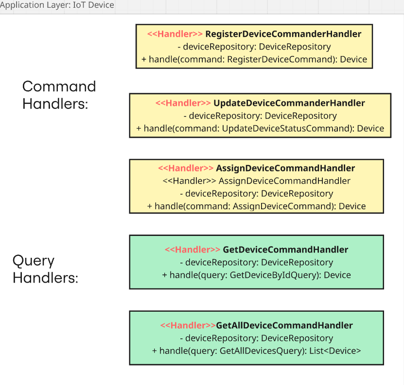
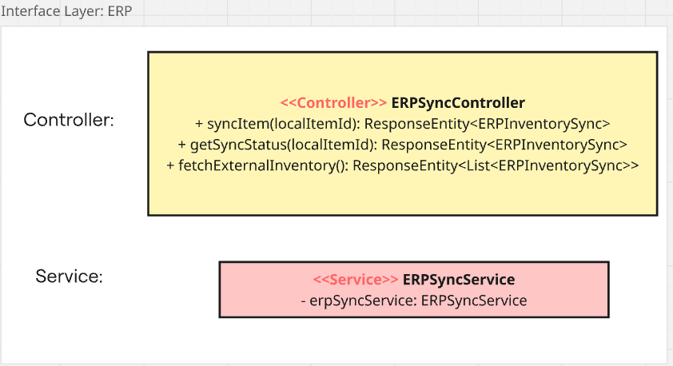
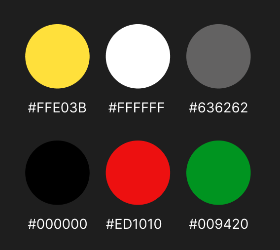
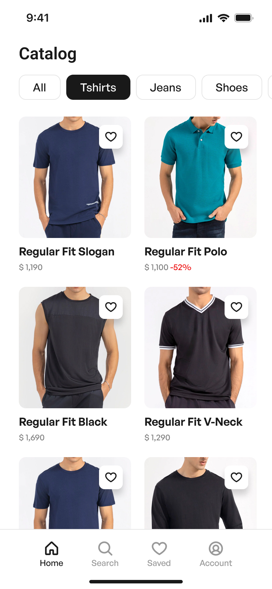
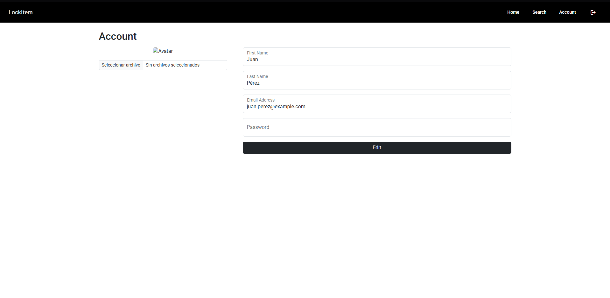

<p align="center">
  
</p>

<h3 align="center"> Universidad Peruana de Ciencias Aplicadas</h3>
<h4 align="center"> Ingeniería de Software  </h4>
<h4 align="center"> Arquitectura de Foftware Emergentes </h4>
<h4 align="center"> Informe de Trabajo Final </h4>

### Startup: ProdTrackers

#### Team Members

- Arrunátegui Aguilar, Josué David
- Chero Eme, Eduardo Andre
- Cortes Hidalgo, Nicolas Andres
- Olivera Guerra, Santiago Mickelle
- Stefano Máquez, Piero 
- Surco Reyes, Franco

#### Sección: SI728

#### Profesor: Marco Antonio León Baca

#### Producto: LockItem

#### Ciclo: 2025-01

<h4 align="center"> Abril, 2025</h4>

___

# Registro de versiones del informe

| Versión | Fecha      | Autor             | Descripción de modificación                                                                           |
|---------|------------|-------------------|-------------------------------------------------------------------------------------------------------|
| 1.0     | 10/04/2025 | Eduardo Chero     | Creación del archivo base en Markdown para el desarrollo del Final Project                            |
| 2.0     | 13/05/2025 | Piero Márquez     | Actualización del siguiente contenido: Project Report Collaboration Insights y Anexos                           |
| 2.1     | 13/05/2025 | Franco Surco     | Se agrego el siguiente contenido: Capitulo 5                     |
| 2.2     | 13/05/2025 | Nicolas Cortes     | Se agrego el siguiente contenido: Capitulo 6                     |
| 3.0     | 27/05/2025 | Santiago Olivera    | Se empezo el sprint 2
| 3.1     | 05/06/2025 | Josué Arrunátegui    | Se edito el sprint 2
| 3.2    | 15/06/2025 | Piero Márquez   | Se empezo agrego el punto 6.3
| 3.3    | 19/06/2025 | Santiago Olivera   | Se empezo agrego el punto 6.4 Video About-the-Product
---

# Project Report Collaboration Insights


## Project Report


Link: https://github.com/ProdTrackers/Report

TB1: El equipo ha cumplido con éxito los puntos solicitados para la entrega. Durante el proceso de adaptación al entorno documental, enfrentamos algunos desafíos al planear correctamente el proyecto al inicio pero al final logramos encontrar nuestro enfoque. Como equipo nos sentimos satisfechos de haber alcanzado los objetivos propuestos.

TP: El equipo ha cumplido con éxito los puntos solicitados para la entrega. Durante el proceso de documentación y programación se enfretaron algunos desafios al momento de diseñar los mock-ups y elegir las herramientas que se usaran para la landing page y el frontend pero se pudo llegar a un acuerdo y llegar al 100% del desarrollo. Como equipo nos sentimos satisfechos de alcanzar el objetivo de esta entrega.

TB2: El equipo ha cumplido con éxito los puntos solicitados para la entrega. Durante el proceso de desarrollo del backend y el iot no hubo muchos problemas ya que el equipo esta acostumbrado a estos proyectos pero en la codificación del wokwi y el iot_edge se tuvieron algunas dificultades al ser nuevas tecnologias a la que el equipo no esta acostumbrado pero se logro con exito una primera versión para esta entrega.

### Analiticos para el TB1


### Analiticos para el TP


### Analiticos para el TB2

# Contenido

- [Registro de versiones del informe](#registro-de-versiones-del-informe)
- [Contenido](#contenido)
- [Student Outcome](#student-outcome)
- [Capítulo I: Introducción](#capítulo-i-introducción)
  - [1.1. Startup Profile](#11-startup-profile)
    - [1.1.1. Descripción de la Startup](#111-descripción-de-la-startup)
    - [1.1.2. Perfiles de integrantes del equipo](#112-perfiles-de-integrantes-del-equipo)
  - [1.2. Solution Profile](#12-solution-profile)
    - [1.2.1 Antecedentes y problemática](#121-antecedentes-y-problemática)
    - [1.2.2 Lean UX Process](#122-lean-ux-process)
      - [1.2.2.1. Lean UX Problem Statements](#1221-lean-ux-problem-statements)
      - [1.2.2.2. Lean UX Assumptions](#1222-lean-ux-assumptions)
      - [1.2.2.3. Lean UX Hypothesis Statements](#1223-lean-ux-hypothesis-statements)
      - [1.2.2.4. Lean UX Canvas](#1224-lean-ux-canvas)
  - [1.3. Segmentos objetivo](#13-segmentos-objetivo)
- [Capítulo II: Requirements Elicitation \& Analysis](#capítulo-ii-requirements-elicitation--analysis)
  - [2.1. Competidores](#21-competidores)
    - [2.1.1. Análisis competitivo](#211-análisis-competitivo)
    - [2.1.2. Estrategias y tácticas frente a competidores](#212-estrategias-y-tácticas-frente-a-competidores)
  - [2.2. Entrevistas](#22-entrevistas)
    - [2.2.1. Diseño de entrevistas](#221-diseño-de-entrevistas)
    - [2.2.2. Registro de entrevistas](#222-registro-de-entrevistas)
    - [2.2.3. Análisis de entrevistas](#223-análisis-de-entrevistas)
  - [2.3. Needfinding](#23-needfinding)
    - [2.3.1. User Personas](#231-user-personas)
    - [2.3.2. User Task Matrix](#232-user-task-matrix)
    - [2.3.3. User Journey Mapping](#233-user-journey-mapping) 
    - [2.3.4. Empathy Mapping](#234-empathy-mapping)
    - [2.3.5. As-is Scenario Mapping](#235-as-is-scenario-mapping)
  - [2.4. Ubiquitous Language](#24-ubiquitous-language)
- [Capítulo III: Requirements Specification](#capítulo-iii-requirements-specification)
  - [3.1. To-Be Scenario Mapping](#31-to-be-scenario-mapping)
  - [3.2. User Stories](#32-user-stories)
  - [3.3. Impact Mapping](#33-impact-mapping)
  - [3.4. Product Backlog](#34-product-backlog)
- [Capítulo IV: Solution Software Design](#capítulo-iv-solution-software-design)
  - [4.1. Strategic-Level Domain-Driven Design](#41-strategic-level-domain-driven-design)
    - [4.1.1. EventStorming](#411-eventstorming)     
	    - [4.1.1.1. Candidate Context Discovery](#4111-candidate-context-discovery)
	    - [4.1.1.2. Domain Message Flows Modeling](#4212-domain-message-flows-modeling)
	    - [4.1.1.3. Bounded Context Canvases](#4113-bounded-context-canvases)
	      - [User bounded context canvas](#user-bounded-context-canvas)
	      - [Iot device management bounded context canvas](#iot-device-management-bounded-context-canvas)
	      - [Inventory management bounded context canvas](#inventory-management-bounded-context-canvas)
	      - [ERP integration bounded context canvas](#erp-integration-bounded-context-canvas)
    - [4.1.2. Context Mapping](#412-context-mapping)
    - [4.1.3. Software Architecture](#413-software-architecture)
	    - [4.1.3.1. Software Architecture System Landscape Diagram](#4131-software-architecture-system-landscape-diagram)
	    - [4.1.3.2. Software Architecture Context Level Diagrams](#4132-software-architecture-context-level-diagrams)
	    - [4.1.3.3. Software Architecture Container Level Diagrams](#4133-software-architecture-container-level-diagrams)
	    - [4.1.3.4. Software Architecture Deployment Diagrams](#4134-software-architecture-deployment-diagrams)
  - [4.2. Tactical-Level Domain-Driven Design](#42-tactical-level-domain-driven-design)
	- [4.2.1. Bounded Context: User](#421-bounded-context:-user)
	    - [4.2.1.1. Domain Layer](#4211-domain-layer)
	    - [4.2.1.2. Interface Layer](4212-interface-layer)
	    - [4.2.1.3. Application Layer](4213-application-layer)
	    - [4.2.1.4. Infrastructure Layer](4214-infrastructure-layer)
	    - [4.2.1.5. Bounded Context Software Architecture Component Level Diagrams](4215-bounded-context-software-architecture-component-level-diagrams)
	    - [4.2.1.6. Bounded Context Software Architecture Code Level Diagrams](4216-bounded-context-software-architecture-code-level-diagrams)
	        - [4.2.1.6.1. Bounded Context Domain Layer Class Diagrams](42161-bounded-context-domain-layer-class-diagrams)
	        - [4.2.1.6.2. Bounded Context Database Design Diagram](42162-bounded-context-database-design-diagram)
	- [4.2.2. Bounded Context: IoT Device](#422-bounded-context-iot-device)
		 - [4.2.2.1. Domain Layer](#4221-domain-layer)
		 - [4.2.2.2. Interface Layer](#4222-interface-layer)
		 - [4.2.2.3. Application Layer](#4223-application-layer)
		 - [4.2.2.4. Infrastructure Layer](#4224-infrastructure-layer)
		 - [4.2.2.5. Bounded Context Software Architecture Component Level Diagrams](#4225-bounded-context-software-architecture-component-level-diagrams)
		 - [4.2.2.6. Bounded Context Software Architecture Code Level Diagrams](#4226-bounded-context-software-architecture-code-level-diagrams)
			 - [4.2.2.6.1. Bounded Context Domain Layer Class Diagrams](#42261-bounded-context-domain-layer-class-diagrams)
			 - [4.2.2.6.2. Bounded Context Database Design Diagram](#42262-bounded-context-database-design-diagram)
	 - [4.2.3. Bounded Context: Inventory](#423-bounded-context-inventory)
		 - [4.2.3.1. Domain Layer](#4231-domain-layer)
		 - [4.2.3.2. Interface Layer](#4232-interface-layer)
		 - [4.2.3.3. Application Layer](#4233-application-layer)
		 - [4.2.3.4. Infrastructure Layer](#4234-infrastructure-layer)
		 - [4.2.3.5. Bounded Context Software Architecture Component Level Diagrams](#4235-bounded-context-software-architecture-component-level-diagrams)
		 - [4.2.3.6. Bounded Context Software Architecture Code Level Diagrams](#4236-bounded-context-software-architecture-code-level-diagrams)
			 - [4.2.3.6.1. Bounded Context Domain Layer Class Diagrams](#42361-bounded-context-domain-layer-class-diagrams)
			 - [4.2.3.6.2. Bounded Context Database Design Diagram](#42362-bounded-context-database-design-diagram)
	 - [4.2.4. Bounded Context: ERP](#424-bounded-context-erp)
		 - [4.2.4.1. Domain Layer](#4241-domain-layer)
		 - [4.2.4.2. Interface Layer](#4242-interface-layer)
		 - [4.2.4.3. Application Layer](#4243-application-layer)
		 - [4.2.4.4. Infrastructure Layer](#4244-infrastructure-layer)
		 - [4.2.4.5. Bounded Context Software Architecture Component Level Diagrams](#4245-bounded-context-software-architecture-component-level-diagrams)
		 - [4.2.4.6. Bounded Context Software Architecture Code Level Diagrams](#4246-bounded-context-software-architecture-code-level-diagrams)
			 - [4.2.4.6.1. Bounded Context Domain Layer Class Diagrams](#42461-bounded-context-domain-layer-class-diagrams)
			 - [4.2.4.6.2. Bounded Context Database Design Diagram](#42462-bounded-context-database-design-diagram) 
- [Capítulo V: Solution UI/UX Design](#capítulo-v-solution-uiux-design)
  - [5.1. Style Guidelines](#51-style-guidelines)
    - [5.1.1. General Style Guidelines](#511-general-style-guidelines)
    - [5.1.2. Web, Mobile and IoT Style Guidelines](#512-web-mobile-and-iot-style-guidelines)
  - [5.2. Information Architecture](#52-information-architecture)
    - [5.2.1. Organization Systems](#521-organization-systems)
    - [5.2.2. Labeling Systems](#522-labeling-systems)
    - [5.2.3. SEO Tags and Meta Tags](#523-seo-tags-and-meta-tags)
    - [5.2.4. Searching Systems](#524-searching-systems)
    - [5.2.5. Navigation Systems](#525-navigation-systems)
  - [5.3. Landing Page UI Design](#53-landing-page-ui-design)
    - [5.3.1. Landing Page Wireframe](#531-landing-page-wireframe)
    - [5.3.2. Landing Page Mock-up](#532-landing-page-mock-up)
  - [5.4. Applications UX/UI Design](#54-applications-uxui-design)
    - [5.4.1. Applications Wireframes](#541-applications-wireframes)
    - [5.4.2. Applications Wireflow Diagrams](#542-applications-mock-ups)
    - [5.4.3. Applications Mock-ups](#543-applications-mock-ups)
    - [5.4.4. Applications User Flow Diagrams](#544-applications-user-flow-diagrams)
  - [5.5. Applications Prototyping](#55-applications-prototyping)
- [Capítulo VI: Product Implementation, Validation & Deploymeny](#capítulo-vi-product-implementation-validation--deployment)
  - [6.1. Software Configuration Management.](#61-software-configuration-management)
    - [6.1.1. Software Development Environment Configuration. ](#611-software-development-environment-configuration)
    - [6.1.2. Source Code Management. ](#612-source-code-management)
    - [6.1.3. Source Code Style Guide & Conventions.](#613-source-code-style-guide--conventions)
    - [6.1.4. Software Deployment Configuration.](#614-software-deployment-configuration)
  - [6.2. Landing Page, Services & Applications Implementation.](#62-landing-page-services--applications-implementation)
    - [6.2.1. Sprint 1](#621-sprint-1)
      - [6.2.1.1. Sprint Planning 1. ](#6211-sprint-planning-1)
      - [6.2.1.2 Aspect Leaders and Collaborators.](#6212-aspect-leaders-and-collaborators)
      - [6.2.1.3 Sprint Backlog 1.](#6213-sprint-backlog-1)
      - [6.2.1.4. Development Evidence for Sprint Review.](#6214-development-evidence-for-sprint-review)
      - [6.2.1.5. Testing Suite Evidence for Sprint Review.](#6215-testing-suite-evidence-for-sprint-review)
      - [6.2.1.6. Execution Evidence for Sprint Review.](#6216-execution-evidence-for-sprint-review)
      - [6.2.1.7. Services Documentation Evidence for Sprint Review.](#6217-services-documentation-evidence-for-sprint-review)
      - [6.2.1.8. Software Deployment Evidence for Sprint Review. ](#6218-software-deployment-evidence-for-sprint-review)
      - [6.2.1.9. Team Collaboration Insights during Sprint.](#6219-team-collaboration-insights-during-sprint)
    - [6.2.2. Sprint 2](#622-sprint-2)
      - [6.2.2.1. Sprint Planning 2. ](#6221-sprint-planning-2)
      - [6.2.2.2 Aspect Leaders and Collaborators.](#6222-aspect-leaders-and-collaborators)
      - [6.2.2.3 Sprint Backlog 2.](#6223-sprint-backlog-2)
      - [6.2.2.4. Development Evidence for Sprint Review.](#6224-development-evidence-for-sprint-review)
      - [6.2.2.5. Testing Suite Evidence for Sprint Review.](#6225-testing-suite-evidence-for-sprint-review)
      - [6.2.2.6. Execution Evidence for Sprint Review.](#6226-execution-evidence-for-sprint-review)
      - [6.2.2.7. Services Documentation Evidence for Sprint Review.](#6227-services-documentation-evidence-for-sprint-review)
      - [6.2.2.8. Software Deployment Evidence for Sprint Review. ](#6228-software-deployment-evidence-for-sprint-review)
      - [6.2.2.9. Team Collaboration Insights during Sprint.](#6229-team-collaboration-insights-during-sprint)
  - [6.3 Validations Interviews](#63-validations-interviews)
    - [6.3.1 Diseño de Entrevistas.](#631-diseño-de-entrevistas)
    - [6.3.2 Registro de Entrevistas.](#632-registro-de-entrevistas)
    - [6.3.3 Evaluaciones según heurísticas.](#633-evaluaciones-según-heurísticas)
  - [6.4 Video About-the-Product](#64-video-about-the-product)


[Conclusiones](#conclusiones)
[Bibliografía](#bibliografia)

---

# Student Outcome
<table border="1">
  <tr>
    <th>Criterio específico</th>
    <th>Acciones realizadas</th>
    <th>Conclusiones</th>
  </tr>
  <tr>
    <td>Trabaja en equipo para 
proporcionar liderazgo en 
forma conjunta </td>
    <td>
      <p>Márquez, Piero Stefano <br> 
      TB1:<br> 
      Organicé y gestioné los documentos clave, incluyendo la publicación del video de las entrevistas y su analisis. Además, desarrollé estrategias y tácticas competitivas para posicionarnos frente a los competidores, y participé activamente en el diseño, análisis y registro de entrevistas. También trabajé en la creación y priorización del product backlog, asegurando que todas las tareas estuvieran alineadas con los objetivos del proyecto. Por último, colaboré en los capítulos 3 y 4 del proyecto, contribuyendo de manera significativa a su desarrollo y asegurando el avance según lo planificado.<br>
      TP:<br> 
      Organicé y gestioné la entrega del proyecto y toda su documentación, asegurando el cumplimiento de plazos y la calidad de los entregables. Participé activamente en los capítulos 5 y 6, contribuyendo al diseño, análisis y redacción de los contenidos clave. Además, desarrollé parte de la landing page y participe en la implementación del frontend, haciéndome cargo del componente Account. Con estas labores, aseguré la coherencia técnica y funcional de la aplicación y facilité la comunicación entre los miembros del equipo.<br>
      TB2:<br> 
      Organicé y gestioné la entrega del proyecto y toda su documentación, asegurando el cumplimiento de plazos y la calidad de los entregables. Participé activamente en el sprint 2 y el capitulo 6.3 y 6.4. Además, desarrollé parte del backend. Con estas labores, aseguré la coherencia técnica y funcional de la aplicación y facilité la comunicación entre los miembros del equipo.<br>
      </p>
      <p>Arrunátegui Aguilar, Josué David<br> 
      TB1:<br>
	  Me encargué de la elaboración de los Domain Message Flow Models para los distintos eventos que gestionará el sistema, asegurando la correcta 	representación de la interacción entre actores, servicios y dispositivos IoT dentro de la arquitectura propuesta. Asimismo, desarrollé los Bounded Context Canvas para los principales módulos del sistema, lo que permitió delimitar responsabilidades, identificar eventos clave y establecer límites claros entre dominios. Estas tareas facilitaron una comprensión compartida dentro del equipo, promoviendo una mejor coordinación técnica y una toma de decisiones colaborativa. Mi participación activa en estas actividades fue clave para ejercer un liderazgo conjunto y establecer una base sólida para el desarrollo distribuido del sistema. 
      <br>
    TP:<br>
    Me encargué de apoyar en la documentación de los capítulos 5 y 6 del proyecto. Asimismo, participé en el diseño y desarrollo de la landing page. En el frontend, implementé la pantalla Home, integrando la lógica de presentación y validando los flujos de datos para garantizar su correcto funcionamiento en distintos dispositivos. Estas tareas promovieron una visión compartida de la interfaz y agilizaron la coordinación del equipo.
      <br>
	TB2:<br>
	Durante esta entrega, asumí un rol activo en el desarrollo de la aplicación móvil, aportando de manera significativa al mayor avance técnico logrado hasta el momento. Coordiné con mis compañeros para integrar las funcionalidades principales y asegurar que el diseño y la lógica implementada fueran consistentes con los objetivos del proyecto. Mi enfoque estuvo en mantener una comunicación constante, resolver desafíos técnicos de forma colaborativa y tomar decisiones conjuntas para garantizar un desarrollo fluido y eficiente. Esta participación fortaleció el liderazgo compartido dentro del equipo y promovió una dinámica horizontal basada en la confianza técnica mutua. 
      <br>
      </p>
      <p>Chero Eme, Eduardo Andre<br> 
      TB1:<br> 
Me encargué de la elaboración de las historias de usuario (user stories) para los distintos actores del sistema, asegurando su alineación con los objetivos del producto y aplicando buenas prácticas de redacción técnica y criterios de aceptación en formato Gherkin. También desarrollé las secciones correspondientes al enfoque Lean UX, lo que permitió integrar la perspectiva del usuario en las fases tempranas del diseño. Estas tareas fueron clave para establecer una base funcional clara y centrada en el valor del usuario.
</p>
	    TP:<br>
	    Durante el desarrollo del sistema de autenticación para el proyecto, participé activamente en el trabajo en equipo, colaborando con mis compañeros en la planificación y coordinación de tareas. Mi enfoque estuvo en el desarrollo de funcionalidades clave como el login, el registro de usuarios y la recuperación de contraseñas, asegurándome de mantener una comunicación constante para alinear esfuerzos y tomar decisiones conjuntas. Esta experiencia fortaleció nuestras habilidades de liderazgo compartido, ya que integramos ideas y asumimos responsabilidades colectivas para lograr un resultado exitoso. exitoso.<br><br>
      TB2:<br>
      Durante este sprint, asumí un rol activo en el trabajo colaborativo, proporcionando liderazgo desde el enfoque técnico en diversas áreas del proyecto. Participé en reuniones de planificación y seguimiento, proponiendo soluciones y coordinando esfuerzos para asegurar una integración efectiva entre el backend, el sistema IoT y la aplicación móvil. Lideré decisiones clave como la estructuración del backend bajo una arquitectura monolítica organizada por Bounded Contexts, y la implementación del método de zonificación básica en el edge IoT mediante dispositivos ESP32. Estas decisiones se tomaron de manera consensuada con el equipo, promoviendo un ambiente horizontal. Además, brindé apoyo técnico a mis compañeros, resolviendo dudas sobre el consumo de APIs y la configuración de entornos de desarrollo, lo que fortaleció el aprendizaje conjunto y la autonomía del equipo.
      <br>
      <p>Cortes Hidalgo, Nicolas Andres <br> 
      TB1:<br> 
      Me encargué de la elaboracion de los bounded context de Usuario, Dispositivos IoT, Inventarios y ERP, enfocandome en la elbaoracion de los diagramas tanto de componente como de clases, para tener una base principal en lo que sera el desarrollo a profundidad de la arquitectura del sistema en el cual nos estamos enfocando. Del mismo modo, realize mi video de exposicion complerando las partes necesarias en el canvas desarollado.<br>
	      <br>TP:<br> 
      Apoye en la organización del sprint 1, bajo el cual nos regimos las tareas y trate de coordinar la gran mayoriía de las mismas para asegurar una correcta realización del mismo. Tambien apoye en el desarrollo de la app web.<br>
      </p>
	    <br>TB2:<br> 
      Apoye al equipo con las entregas respectivas para este entreganle y para la elaboracion del sprint 2, en el cual nos encargamos principalmente de la integracion front y back, generar un prototipo wokwi funcional, entre otras tareas menores.<br>
	</p>
      <p>Olivera Guerra, Santiago Mickelle <br> 
      TB1:<br> 
      Durante esta primera entrega trabajé con el software de miro y mediante Gooogle meet coordine con mi compañero la arquitectura de los cuatro bounded context y la cocherencia entre sus 4 capas y su arquitectura.<br>
	    TP:<br>
	    Ejecuté satisfactoriamente mis tareas mientras establecí una comunicación continua con mi equipo de trabajo para la coordinación efectiva de cambios y versiones.<br>
	       TB2:<br>
      Colaboré en la elaboración de los endpoints del iot device  y en la detección de reservas con el LED, trabajando estrechamente con el resto del equipo para definir criterios de usabilidad claros.<br>
      <p>Surco Reyes, Franco<br> 
      TB1:<br> 
      Apoye con el desarrollo de los diagramas del C4 Model (Landscape, Context, Container y Deployment) utilizando Structurizr. Esto nos ha permitido mapear estratégicamente los componentes clave que utilizaremos, garantizando una visión integral y compartida del sistema.<br>
      TP:<br> 
      Apoye con el desarrollo de una seccion del landing page, en la aplicacion web con la vista account y el logout.<br>
      TB2:<br>
      Colaboré en la elaboración de las heurísticas y en la detección de problemas a resolver en fases posteriores, trabajando estrechamente con el resto del equipo para definir criterios de usabilidad claros.
      </p>
    </td>
    <td>Liderazgo Colaborativo y Enfoque Interdisciplinario
El desarrollo de soluciones de software se benefició de un enfoque colaborativo e interdisciplinario, donde la integración de conocimientos técnicos y el trabajo conjunto entre áreas permitieron abordar eficazmente cada fase del proyecto. Esta dinámica no solo fortaleció la calidad técnica del producto, sino que también promovió la comunicación efectiva y el liderazgo compartido, preparando al equipo para enfrentar desafíos complejos en entornos profesionales diversos.</td>
  </tr>
  <tr>
    <td>Crea un entorno colaborativo e 
inclusivo, establece metas, 
planifica tareas y cumple 
objetivos.</td>
    <td>
      <p>Márquez, Piero Stefano <br> 
      TB1:<br> 
      Durante la primera entrega, organicé y gestioné documentos clave, como el video de entrevistas y analisis de la mismas. También participé en el diseño y priorización del product backlog, asegurando que todas las tareas estuvieran alineadas con los objetivos. Gracias a una planificación clara, el equipo avanzó de manera colaborativa en los capítulos 3 y 4, cumpliendo con los plazos establecidos.<br>
      </p>
      TP:<br> 
      Como líder de equipo, organicé y coordiné al grupo para la correcta entrega de la documentación, asignando a cada miembro las responsabilidades de carga de archivos y estableciendo plazos claros. Paralelamente, me centré en el desarrollo de la programación, implementando funcionalidades clave y resolviendo retos técnicos. Además, revisé y validé que toda la información estuviera completa y alineada con los requisitos antes de enviar los documentos necesarios, garantizando así la calidad y puntualidad de las entregas.<br>
      TB2:<br> 
      En mi rol como líder de equipo, me encargué de organizar y coordinar al grupo para asegurar la entrega adecuada de la documentación, asignando tareas específicas relacionadas con la carga de archivos y definiendo plazos concretos. Al mismo tiempo, participé activamente en el desarrollo del código, implementando funcionalidades esenciales y resolviendo desafíos técnicos. También realicé la revisión y validación final de la documentación, verificando que toda la información estuviera completa y cumpliera con los requisitos establecidos, asegurando así entregas de calidad y en el tiempo previsto.<br>
      </p>
      <p>Arrunátegui Aguilar, Josué David<br> 
      TB1:<br> 
      Fomenté un entorno colaborativo al coordinar con los distintos miembros del equipo la elaboración de los Domain Message Flow Models y los Bounded Context Canvas, asegurando que todos comprendieran su propósito y pudieran aportar desde sus áreas. Establecí metas claras para la entrega de estos artefactos y organicé las tareas de forma que se alinearan con los plazos generales del proyecto. Gracias a esta planificación y al trabajo conjunto, se logró integrar de manera efectiva estos elementos en el diseño del sistema, cumpliendo con los objetivos técnicos y facilitando una comunicación fluida entre los distintos roles del equipo.<br>
      TP:<br> 
      Fomenté un entorno colaborativo al coordinar con los distintos miembros del equipo la elaboración y revisión de la documentación de los capítulos 5 y 6, asegurando que todos comprendieran su estructura y aportaran los contenidos necesarios. Establecí metas claras para el desarrollo de la landing page y la pantalla Home del frontend, organizando las tareas de diseño, maquetado e integración de componentes para que se cumplieran dentro del plazo establecido. Gracias a esta planificación y al trabajo conjunto, logramos integrar de manera efectiva la documentación técnica y las interfaces principales en el entregable final, cumpliendo con los objetivos de usabilidad y facilitando una comunicación fluida entre diseñadores y desarrolladores.
      </p>
	TB2:<br> 
      Contribuí activamente a la creación de un entorno colaborativo al liderar la implementación de funcionalidades clave en la aplicación móvil. Establecí metas claras para los componentes que desarrollé y planifiqué su integración de forma coordinada con el backend y otros módulos del sistema. Esta planificación, junto con una comunicación abierta con los demás miembros del equipo, permitió cumplir con los objetivos técnicos establecidos para la entrega, asegurando la calidad del avance y fomentando un ambiente inclusivo donde todos pudieron aportar y resolver dudas de manera conjunta.
	<br>
      <p>Chero Eme, Eduardo Andre<br> 
      TB1:<br> 
      Contribuí a generar un entorno colaborativo mediante la creación de historias de usuario que guiaron el trabajo del equipo y facilitaron la planificación en el backlog. Además, elaboré las secciones de Lean UX, lo que ayudó a que el equipo tuviera una comprensión compartida de las necesidades de los usuarios. Estas acciones permitieron que el equipo priorizara de forma efectiva y avanzara de manera alineada con los objetivos planteados.<br>
      </p>
	    TP:<br>
	    Para el desarrollo de las funcionalidades de login, registro y recuperación de contraseñas, promoví un entorno de colaboración e inclusión, donde cada integrante del equipo pudo expresar sus ideas y aportar desde su experiencia. Establecimos objetivos claros y realizamos una planificación conjunta que permitió dividir tareas de manera equitativa y eficiente. Esta estrategia nos ayudó a cumplir con los plazos establecidos y a integrar de manera exitosa las funcionalidades en el sistema, fomentando un ambiente de respeto y apoyo mutuo.<br>
      TB2:<br>
      Contribuí activamente a crear un entorno colaborativo e inclusivo al participar en la planificación y definición de metas claras para el sprint, distribuyendo responsabilidades según las capacidades del equipo. Establecí los entregables del backend (endpoints para usuarios, prendas y tiendas), estimando tiempos de implementación y asegurando su alineación con los objetivos del producto. En el área de IoT, planifiqué y ejecuté la simulación del edge utilizando Wokwi y ESP32, logrando transmitir datos hacia el backend. En paralelo, implementé partes funcionales de la aplicación móvil que interactúan con la API desarrollada, permitiendo visualizar el flujo completo de datos. Gracias a esta planificación y coordinación, se cumplieron los objetivos técnicos del sprint y se avanzó de manera sólida hacia un MVP funcional.
      </p>
      <p>Cortes Hidalgo, Nicolas Andres <br> 
      TB1:<br> 
      Durante esta primera entrega, tuve que profundizar en lo que son los diagramas c4, para asi poder construir de forma adecuada cada uno de los diagramas de componentes necesarios para los 4 bounded context que hemos definido para este sistema. Del mismo modo, realice una investigacion profunda en lo que corresponde a los diagramas de clase, para asi poder realizar de forma apropiada los diagramas respectivos de cada uno de los bounded context mencionados anteriormente.<br>
      <br>TP:<br> 
      Durante esta entrega, logre organizar de manera adecuada al equipo para coordinar la realización del sprint 1 de forma efectiva, además, apoye en la documentación del informe.<br>
	      <br>TB2:<br> 
      Apoye en la integración del frontend y backend, asegurando un correcto despliegue de la aplicación, asegurandonos de que para esta entrega sea 100% funciona a traves de un enlace web.<br>
      </p>
      <p>Olivera Guerra, Santiago Mickelle <br> 
      TB1:<br> 
      Durante la primera entrega, me encargué de los layers para los principales Bounded Context: User, Inventory, Device y ERP, para planificar unn correcto desarrollo de Backend siguiendo respetando el core del negocio y aplicando ddd correctamente. <br>
      </p>
	TP:<br>
	    Para el desarrollo de las funcionalidades de search y productos, promoví un entorno de colaboración e inclusión. Establecimos objetivos claros y realizamos una planificación conjunta que permitió dividir tareas de manera equitativa y eficiente. Esta estrategia nos ayudó a cumplir con los plazos establecidos y a integrar de manera exitosa las funcionalidades en el sistema, fomentando un ambiente de respeto y apoyo mutuo.<br><br>
	      TB2:<br>
      En esta entrega, identifiqué los problemas en el backend respecto algunos endpoints relacionados. Para cada hallazgo, evalué su impacto en la experiencia de usuario y establecí un orden de prioridad que nos permitirá enfocar los esfuerzos de mejora. Este diagnóstico detallado servirá de base para las próximas iteraciones de diseño, garantizando soluciones más intuitivas y alineadas con las necesidades reales de nuestros usuarios.
      <p>Surco Reyes, Franco <br> 
      TB1:<br> 
	  	Durante la primera entrega, contribui mapeando estrategicamente los componente tecnologicos que utilizaremos para nuestro proyecto, para luego definir la arquitectura del sistema con claridad. <br>
      TP:<br> 
      Para el desarrollo de la aplicacion web y landing page se mantuvo comunicacion con el equipo.<br>
      TB2:<br>
      En esta entrega, identifiqué los problemas heurísticos detectados a partir de las entrevistas de validación con cada segmento objetivo. Para cada hallazgo, evalué su impacto en la experiencia de usuario y establecí un orden de prioridad que nos permitirá enfocar los esfuerzos de mejora. Este diagnóstico detallado servirá de base para las próximas iteraciones de diseño, garantizando soluciones más intuitivas y alineadas con las necesidades reales de nuestros usuarios.
      </p>
    </td>
    <td>El equipo consolidó un ambiente colaborativo e inclusivo, con comunicación efectiva a través de WhatsApp y Discord. Las reuniones frecuentes permitieron una coordinación fluida y resolución oportuna de dudas. Cada integrante contribuyó activamente, estableciendo metas claras y distribuyendo responsabilidades de forma equitativa. El apoyo mutuo y la capacidad para corregir errores fueron claves para cumplir los plazos y alcanzar los objetivos del proyecto de manera eficiente.</td>
  </tr>
</table>


---

# Capítulo I: Introducción

## 1.1. Startup Profile

### 1.1.1. Descripción de la Startup

ProdTrackers ha desarrollado **LockItem**, una solución basada en IoT que permite a los clientes de tiendas de ropa
localizar prendas que han sido movidas de su lugar original. Mediante sensores integrados en las etiquetas de seguridad
de las prendas, los usuarios pueden acceder al catálogo de la tienda a través de una app móvil, seleccionar el artículo
que desean, y recibir la ubicación precisa en tiempo real. Esta tecnología mejora la experiencia de compra al reducir el
tiempo de búsqueda y aumenta la eficiencia operativa de las tiendas.

LockItem, desarrollado por Debuggers, no solo optimiza el flujo de clientes en los establecimientos, sino que también
contribuye a una gestión de inventario más efectiva para los minoristas. Al ofrecer una experiencia de compra más fluida
y tecnológicamente avanzada, Debuggers se posiciona como un innovador en la transformación digital del sector minorista,
conectando el mundo físico y digital a través de soluciones IoT.

**Misión:**

En ProdTrackers, nuestra misión es desarrollar soluciones tecnológicas innovadoras que conecten el mundo físico y digital,
proporcionando a las empresas minoristas en el Perú herramientas basadas en IoT para una gestión eficiente de productos.
Nos enfocamos en mejorar la experiencia de compra de los clientes, optimizando la localización de productos en tiempo
real, y ayudando a nuestros socios comerciales a maximizar su eficiencia operativa.

**Visión:**

Convertirnos en la empresa líder en la implementación de tecnologías IoT para el sector minorista en el Perú, impulsando
una transformación digital que permita a las tiendas físicas adaptarse a los desafíos del futuro. Aspiramos a que
nuestras soluciones revolucionen la gestión de inventarios y la experiencia de compra, estableciendo nuevos estándares
en la industria minorista peruana y contribuyendo al crecimiento de un ecosistema comercial más moderno y eficiente.

### 1.1.2. Perfiles de integrantes del equipo

| Integrante                                                                                                                                                                                                                                                                                                                               | Chero Eme, Eduardo Andre                                    |
|------------------------------------------------------------------------------------------------------------------------------------------------------------------------------------------------------------------------------------------------------------------------------------------------------------------------------------------|-------------------------------------------------------------|
| **Código:** U20201F282 <br> **Carrera:** Ingeniería de software <br> **Acerca de mí:** Me gustan los videojuegos y las series, quiero especializarme en ciberseguridad para tener una ganancia estable mientras creo videojuegos aparte por pasión. Con experiencia en backend y en frontend con tecnologias como Spring Boot y Angular. |  |

| Integrante                                                                                                                                                                                                                                                                                                                               | Arrunátegui Aguilar, Josué David                   |
|------------------------------------------------------------------------------------------------------------------------------------------------------------------------------------------------------------------------------------------------------------------------------------------------------------------------------------------|----------------------------------------------------|
| **Código:** U202111033 <br> **Carrera:** Ingeniería de Software <br> **Acerca de mí:** Me gusta dibujar, tocar guitarra y jugar videojuegos. Tengo conocimiento en el desarrollo frontend con lenguajes como angular y vue.js, así como desarrollo móvil con flutter. Planeo especializarme en desarrollo web o como Analista de Datos.  |  |

| Integrante                                                                                                                                                                                                                                                                                                                               | Márquez, Piero Stefano                   |
|------------------------------------------------------------------------------------------------------------------------------------------------------------------------------------------------------------------------------------------------------------------------------------------------------------------------------------------|----------------------------------------------------|
| **Código:** U201816402 <br> **Carrera:** Ingeniería de Software <br> **Acerca de mí:** Me gusta leer manga, salir a comer a nuevos lugares los videojuegos y la musica. Tengo conocimiento en el desarrollo frontend con angular y backend con node.js para mi trabajo utilizo bastante el stack MEAN(MongoDb, Express, Anulgar, Node.js) y moviles manejo flutter. Acabando la carrera me gustaria desenvolver como Analista de Datos.  | |

| Integrante                                                                                                                                                                                                                                                                                                                               | Surco Reyes, Franco                   |
|------------------------------------------------------------------------------------------------------------------------------------------------------------------------------------------------------------------------------------------------------------------------------------------------------------------------------------------|----------------------------------------------------|
| **Código:** U202015132 <br> **Carrera:** Ingeniería de Software <br> **Acerca de mí:** Soy estudiante de la carrera de ingeniería de Software en la universidad Peruana de Ciencias Aplicadas, elegí esta carrera por mi pasión por la programación e interés por la tecnología. Me considero una persona responsable y colaborativa, por lo que apoyaré al grupo en lo que se necesite. Además, tengo conocimientos de programación en C++, Python, HTML, CSS, JavaScript y modelado de base de datos en SQL Server. |  |

| Integrante                                                                                                                                                                                                                                                                                                                               | Cortés Hidalgo, Nicolás                   |
|------------------------------------------------------------------------------------------------------------------------------------------------------------------------------------------------------------------------------------------------------------------------------------------------------------------------------------------|----------------------------------------------------|
| **Código:** U202016311 <br> **Carrera:** Ingeniería de Software <br> **Acerca de mí:** Estudiante de la carrera de ingeniería de Software en la UPC, me apasiona la tecnolgía, y me encantra programar en Angular. Me considero una persona proactiva la cual siempre esta dispuesta a colaborar a quien lo necesita, ademas de siempre dar lo maximo en los proyectos en los que me veo involucrado. |  |

| Integrante                                                                                                                                                                                                                                                                                                                               | Santiago Mickelle, Olivera Guerra                   |
|------------------------------------------------------------------------------------------------------------------------------------------------------------------------------------------------------------------------------------------------------------------------------------------------------------------------------------------|----------------------------------------------------|
| **Código:** U20201a821 <br> **Carrera:** Ingeniería de Software <br> **Acerca de mí:** Me considero un estudiante comprometido con el trabajo y desenvolvimiento en el campo profesional con mucho foco para cada uno de los proyectos en los cuales participo y detallisata con los temas a arreglar. Domino tecnologías como Java para Backend como sus frameworks tales como Spring para el desarrollo de APIs , en Front con Angular y Android Studio, por ultimo, SQL a nivel avanzado para inserción y extracción de datos específicos. |  |


## 1.2. Solution Profile

### 1.2.1 Antecedentes y problemática

El solution profile utilizando la metodología **5W2H** (What, Why, Where, When, Who, How, How much) te ayudará a
estructurar claramente tu propuesta de LockItem. A continuación te doy una guía detallada para que puedas desarrollarlo:

**1. What (Qué):**

LockItem es una solución tecnológica basada en IoT que permite a los clientes localizar prendas de ropa dentro de
tiendas físicas, mejorando la experiencia de compra. Utiliza sensores integrados en las etiquetas de seguridad de las
prendas para identificar en tiempo real su ubicación dentro de la tienda, y presenta esa información a través de una
aplicación móvil conectada.

**2. Why (Por qué):**

El problema que se busca resolver es la dificultad que enfrentan los clientes cuando las prendas son movidas de su
ubicación original. Esto puede resultar en una experiencia de compra frustrante, pérdida de tiempo y, en algunos casos,
en la decisión del cliente de no realizar la compra. Además, ayuda a las tiendas a optimizar la gestión de inventario y
mejorar la eficiencia operativa.

**3. Where (Dónde):**

LockItem está pensado para el mercado minorista de ropa en el Perú. Las tiendas afiliadas serían aquellas que buscan
optimizar la experiencia de compra física mediante tecnología, principalmente en grandes centros comerciales y tiendas
de departamentos en áreas urbanas.

**4. When (Cuándo):**

La solución está diseñada para ser implementada durante las etapas de alta demanda en las tiendas, como temporadas de
rebajas, campañas navideñas o de vuelta a clases, cuando la búsqueda de productos es más caótica. Además, puede
funcionar de manera continua para mejorar la experiencia del cliente en cualquier momento del año.

**5. Who (Quiénes):**

Los usuarios principales de LockItem son los clientes de las tiendas afiliadas, quienes podrán localizar sus productos
de manera eficiente. Por otro lado, los empleados de las tiendas también se beneficiarán al poder tener un mayor control
sobre el inventario en tiempo real. Los socios comerciales incluyen las tiendas minoristas que buscan mejorar la
experiencia de compra y optimizar la gestión de sus productos.

**6. How (Cómo):**

La solución utiliza tecnología IoT mediante sensores instalados en las etiquetas de seguridad de las prendas. Estos
sensores están conectados a una plataforma que se integra con una app móvil. Los clientes usan la app para buscar una
prenda, y la app les muestra la ubicación exacta dentro de la tienda en tiempo real. Las tiendas afiliadas podrán
implementar los sensores en sus sistemas de seguridad y vincularlos a la base de datos de productos.

**7. How much (Cuánto cuesta):**

El costo del sistema dependerá del tamaño de la tienda y la cantidad de productos a sensar. Se contemplan costos
iniciales de implementación de los sensores y la infraestructura IoT, junto con una suscripción mensual o anual para el
mantenimiento de la plataforma y la app. Además, el precio puede variar dependiendo del nivel de personalización que
requiera cada tienda afiliada.

### 1.2.2 Lean UX Process

#### 1.2.2.1. Lean UX Problem Statements

**1. Problem Statement (Cliente):**

Nuestro entorno evidencia que los clientes de tiendas de ropa en Perú a menudo experimentan frustración y descontento al
no encontrar las prendas que buscan en su lugar habitual debido a que otros compradores las mueven dentro del
establecimiento. Esto no solo genera una mala experiencia de compra, sino que, en algunos casos, los clientes optan por
no adquirir el producto y abandonan la tienda sin realizar una compra.

Hemos observado que un factor crítico que afecta a los clientes es la dificultad para localizar productos dentro de la
tienda cuando han sido desplazados, lo que incrementa el tiempo invertido en la búsqueda y disminuye la satisfacción
general con la experiencia de compra.

**¿Cómo podemos diseñar una solución tecnológica que permita a los clientes localizar fácilmente las prendas dentro de
la tienda, mejorando así su experiencia de compra y evitando que abandonen sin realizar una compra?**

**2. Problem Statement (Negocio):**

Nuestro entorno evidencia que las tiendas de ropa en Perú enfrentan desafíos para mantener sus prendas organizadas y
fácilmente accesibles para los clientes, lo que impacta negativamente en la eficiencia operativa y en las ventas. La
dificultad para rastrear el movimiento de las prendas dentro del establecimiento también provoca ineficiencias en la
gestión del inventario y una experiencia insatisfactoria para los compradores.

Hemos observado que un factor crítico que afecta a las tiendas es la incapacidad para monitorear en tiempo real la
ubicación de las prendas que han sido movidas, lo que conlleva a pérdidas en ventas y una mayor carga operativa para los
empleados encargados de la reubicación de productos.

**¿Cómo podemos implementar una solución IoT eficiente que permita a las tiendas rastrear el movimiento de las prendas
dentro del establecimiento y optimizar la gestión de inventarios mientras se mejora la experiencia del cliente?**

#### 1.2.2.2. Lean UX Assumptions

**Business Assumptions (Suposiciones de Negocio):**

- Las tiendas minoristas estarán dispuestas a adoptar tecnologías IoT para mejorar la localización de productos, ya que
  ven valor en optimizar la experiencia de compra y la gestión de inventarios.

- El mercado minorista en Perú tiene el presupuesto y los recursos para implementar una solución como LockItem, que
  implica sensores IoT, una app y la integración con sus sistemas de inventario existentes.

- La mejora en la experiencia de compra llevará a un aumento en las ventas, ya que los clientes que encuentran lo que
  buscan rápidamente tienen más probabilidades de realizar compras y fidelizarse con la tienda.

- Las tiendas estarán dispuestas a pagar por una suscripción o servicio continuo para mantener el sistema LockItem
  funcionando, incluyendo actualizaciones y mantenimiento del sistema.

- Las tiendas que implementen LockItem mejorarán su competitividad en el mercado peruano, ya que estarán ofreciendo una
  solución innovadora que optimiza la experiencia del cliente.

**User Assumptions (Suposiciones de Usuario):**

- Los clientes valoran el tiempo y la eficiencia cuando compran en tiendas físicas y están dispuestos a usar una app
  móvil que les ayude a localizar rápidamente las prendas que buscan.

- Los usuarios confían en las soluciones tecnológicas y no tendrán problemas en adoptar la aplicación móvil para mejorar
  su experiencia de compra, siempre que esta sea intuitiva y fácil de usar.

- Los clientes están frustrados por no encontrar las prendas en su lugar original, lo que les genera una experiencia de
  compra insatisfactoria y los motiva a buscar soluciones que mejoren ese aspecto.

- Los usuarios están familiarizados con las aplicaciones móviles y con las tecnologías de localización, lo que
  facilitará la adopción de LockItem sin necesidad de un aprendizaje extenso.

- Los usuarios están dispuestos a proporcionar datos básicos a través de la app (como ubicación en la tienda o
  preferencias de búsqueda) si esto les permite acceder a una experiencia de compra más eficiente y personalizada.

#### 1.2.2.3. Lean UX Hypothesis Statements

Las hipótesis son afirmaciones que pueden probarse a través de experimentos y validaciones. Aquí algunas hipótesis para
LockItem:

Creemos que permitir a los clientes localizar rápidamente las prendas que buscan a través de la app será útil para
compradores que valoran su tiempo, ya que les permitirá evitar frustraciones y optimizar su proceso de compra. Esto es
importante porque facilitará la búsqueda de productos, reduciendo el tiempo en la tienda. Esperamos que esto incremente
la satisfacción del cliente y como resultado, observemos un aumento en la probabilidad de compra en un 15%.

Creemos que integrar sensores IoT en las prendas será beneficioso para los empleados de las tiendas que gestionan
inventarios, ya que reducirá el tiempo invertido en reubicar productos y mejorará la precisión de los inventarios. Esto
es importante porque permitirá una gestión más eficiente del stock. Esperamos que los empleados puedan dedicar más
tiempo a otras tareas importantes y como resultado, se reducirá el tiempo invertido en la reubicación de prendas en un
25%.

Creemos que proporcionar a las tiendas acceso a datos analíticos sobre el movimiento de productos será útil para los
gerentes y encargados de piso, ya que les permitirá reorganizar mejor el espacio de ventas en función del comportamiento
del cliente. Esto es importante porque optimizar la disposición de los productos aumentará las interacciones del cliente
con los artículos. Esperamos que esto incremente las ventas en las áreas más estratégicas y como resultado, veamos un
aumento de las ventas en estas áreas en un 10%.

Creemos que permitir a los clientes recibir notificaciones sobre la reubicación o disponibilidad de productos en tiempo
real será útil para compradores que están interesados en productos específicos, ya que les proporcionará información
personalizada. Esto es importante porque ayudará a mantener a los clientes comprometidos con la tienda. Esperamos que
esto aumente la frecuencia de visitas de los clientes y como resultado, incrementemos el tráfico en la tienda en un 12%.

Creemos que mostrar la disponibilidad de tallas y colores en tiempo real en la app será útil para compradores indecisos
o que buscan múltiples opciones, ya que podrán verificar la disponibilidad antes de dirigirse a la tienda o probarse las
prendas. Esto es importante porque reducirá las consultas al personal de la tienda y acelerará el proceso de compra.
Esperamos que esto mejore la eficiencia operativa y como resultado, disminuya las consultas al personal en un 20%.

#### 1.2.2.4. Lean UX Canvas


## 1.3. Segmentos objetivo

**1. Clientes de tiendas de ropa**

Hombres y mujeres de entre 18 y 45 años, residentes en zonas urbanas de Perú, que prefieren comprar en tiendas físicas y
valoran la rapidez y eficiencia al buscar productos. Estos clientes son usuarios familiarizados con smartphones y
aplicaciones móviles, y buscan una experiencia de compra fluida y sin frustraciones. Están motivados por el deseo de
ahorrar tiempo y obtener un servicio más eficiente mientras realizan sus compras en tiendas de ropa.

**2. Trabajadores de tiendas de ropa:**

Trabajadores de tiendas de ropa, hombres y mujeres de entre 21 y 55 años, que buscan optimizar la gestión de sus
inventarios y mejorar la experiencia de compra de sus clientes. Están familiarizados con la tecnología y dispuestos a
adoptar soluciones innovadoras, como IoT y aplicaciones móviles, para mejorar la eficiencia operativa y aumentar las
ventas. Estos dueños están motivados por la necesidad de reducir costos de mano de obra, mejorar el servicio al cliente,
y mantenerse competitivos en el mercado minorista peruano.


# Capítulo II: Requirements Elicitation & Analysis

## 2.1. Competidores

* **Pricer:** Pricer utiliza etiquetas electrónicas de precio (ESL) para ayudar a los minoristas a actualizar precios y
  gestionar inventarios en tiempo real, mejorando la eficiencia operativa.
* **Neurolabs:** Neurolabs emplea visión artificial y aprendizaje automático para controlar inventarios en tiempo real y
  predecir el comportamiento de los consumidores sin necesidad de etiquetas físicas.

### 2.1.1. Análisis competitivo

<table border="1" cellpadding="10" cellspacing="0" style="margin-left: auto; margin-right: auto;">
  <tr>
    <th colspan="6">Competitive Analysis Landscape</th>
  </tr>
  <tr>
    <td colspan="2" rowspan="2">¿Por qué llevar a cabo este análisis?</td>
    <td colspan="4">El objetivo que tenemos con este análisis es conocer de mejor manera a nuestra competencia y así poder evaluar nuestras oportunidades y ventajas como empresa buscando poder destacar sobre las otras</td>
  </tr>
  <tr>
    <td colspan="4">¿Qué aporte de valor podría ofrecer nuestro producto en contraste al resto de competidores? </td>
  </tr>
  <tr>
   <td colspan="2"></td>
    <td>LockItem</td>
    <td>Pricer</td>
    <td>Neurolabs</td>
  </tr>
  <tr>
    <td rowspan="2">Perfil</td>
    <td>Overview</td>
    <td>Solución IoT para la localización de productos movidos en tiendas de ropa</td>
    <td>Ofrece etiquetas electrónicas de precios para minoristas</td>
    <td>Utiliza visión artificial para la gestión de inventarios</td>
  </tr>
  <tr>
    <td>Ventaja competitiva ¿Que valor ofrece a los clientes?</td>
    <td>Locaclización en tiempo real mediante sensores IoT en prendas</td>
    <td>Automatización de precios e inventarios, con actualizaciones en tiempo real</td>
    <td>Análisis predictivo y control sin necesidad de etiquetas físicas</td>
  </tr>
  <tr>
    <td rowspan="2">Perfil de Marketing</td>
    <td>Mercado objetivo</td>
    <td>Hombres y mujeres entre 18 y 45 años. Tiendas de ropa en Perú</td>
    <td>Minoristas globales, especialmente supermercados y tiendas grandes</td>
    <td>Minoristas que buscan automatizar la gestión de inventorios sin contacto</td>
  </tr>
  <tr>
    <td>Estrategias de marketing</td>
    <td>Enfocada en la eficiencia operativa y mejora de la experiencia del cliente</td>
    <td>Se posiciona como líder en automatización y eficiencia en minoristas </td>
    <td>Apuesta por la innovación y la automatización sin contacto </td>
  </tr>
  <tr>
    <td rowspan="3">Perfil de Producto</td>
    <td>Productos & Servicios</td>
    <td>Sensores IoT para etiquetas de prendas y app de localización en tiempo real</td>
    <td>Sensores IoT para etiquetas de prendas y app de localización en tiempo rea</td>
    <td>Visión artificial, IA para monitoreo de inventarios y comportamiento</td>
  </tr>
  <tr>
    <td>Precios & Costos</td>
    <td>Costos basados en suscripción y sensores según el tamaño de la tienda </td>
    <td>Dependiendo del tamaño de la tienda y volumen de etiquetas necesarias </td>
    <td>Costo de implementación de IA y software personalizado </td>
  </tr>
  <tr>
    <td>Canales de distribucion (Web y/o Movil)</td>
    <td>App móvil y web para tiendas minoristas </td>
    <td>Plataforma web y hardware de etiquetas electrónicas </td>
    <td>Plataforma basada en web con integración a sistemas de inventario </td>
  </tr>
  <tr>
    <td rowspan="5">Analisis SWOT</td>
    <td colspan="5">Realice esto para su startup y sus competidores. Sus fortalezas deberían apoyar sus
    oportunidades y contribuir a lo que ustedes definen como su posible ventaja
    competitiva. </td>
  </tr>
  <tr>
    <td>Fortalezas</td>
    <td>Integración IoT sencilla con sistema de seguridad; mejora la experiencia de compra</td>
    <td>Reducción de costos operativos, optimización de inventarios y precios en tiempo real </td>
    <td>Automatización sin necesidad de etiquetas, precisión en el monitoreo </td>
  </tr>
  <tr>
    <td>Debilidades</td>
    <td> Dependencia de hardware específico en las tiendas </td>
    <td>Costo elevado de instalación inicial de etiquetas electrónicas </td>
    <td>Necesidad de grandes volúmenes de datos para un análisis preciso </td>
  </tr>
  <tr>
    <td>Oportunidades</td>
    <td>Expansión a otros sectores minoristas más allá de la ropa </td>
    <td>Ampliar el uso de la tecnología a mercados emergentes </td>
    <td>Ampliar la tecnología para otros usos, como la personalización de experiencias </td>
  </tr>
  <tr>
    <td>Amenazas</td>
    <td>Competencia en tecnologías IoT de otros mercados </td>
    <td>Nuevas soluciones de bajo costo en el mercado de etiquetas electrónicas </td>
    <td>Competidores que ofrezcan IA con mejores modelos predictivos </td>
  </tr>
</table>

### 2.1.2. Estrategias y tácticas frente a competidores

* Diferenciar la oferta destacando la integración con sistemas de seguridad, para asegurar la protección de productos en
  tiendas, además de la localización en tiempo real
* Expandir el mercado objetivo más allá de tiendas de ropa, incluyendo otros sectores minoristas, para diversificar el
  riesgo y aprovechar nuevas oportunidades
* Fortalecer la experiencia del cliente mediante la mejora continua de la app móvil, asegurando que sea intuitiva y
  ofrezca funcionalidades adicionales como reportes personalizados
* Desarrollar alianzas estratégicas con proveedores de hardware y software para reducir costos de implementación y
  mejorar la escalabilidad del sistema
* Innovar en la tecnología IoT de sensores para ofrecer soluciones que requieran menos mantenimiento y sean más
  adaptables a diferentes entornos de tienda
* Optimizar la estrategia de precios para ofrecer opciones de suscripción flexible, permitiendo a las tiendas ajustar su
  inversión según el tamaño y el volumen de la tienda

## 2.2. Entrevistas

### 2.2.1. Diseño de entrevistas

**Clientes de tiendas de ropa:**

* ¿Qué desafíos enfrentas cuando buscas una prenda específica en una tienda de ropa?
* ¿Qué aspectos de la experiencia de compra te resultan más frustrantes?
* ¿Utilizas alguna aplicación o herramienta para ayudarte en las compras?
* ¿Qué funcionalidades esperas de una aplicación de tienda para mejorar tu experiencia de compra?
* ¿Qué tan importante es para ti poder localizar rápidamente las prendas en una tienda?
* ¿Cómo crees que la tecnología de localización podría mejorar tu experiencia de compra?
* ¿Qué características considerarías más valiosas en una solución de localización de prendas?
* ¿Qué tipo de información te gustaría recibir en una aplicación de tienda?
* ¿Alguna vez has usado una tecnología similar en tiendas? ¿Cómo fue tu experiencia?
* ¿Qué mejorarías en las soluciones actuales que has visto o usado?

**Trabajador de Tiendas de Ropa:**

* ¿Cómo gestionan actualmente el inventario en su tienda?
* ¿Qué desafíos enfrentan con el seguimiento de prendas y el manejo de inventarios?
* ¿Qué tipo de tecnologías utilizan para la gestión de inventarios y la experiencia del cliente?
* ¿Qué tan abiertos están a adoptar nuevas tecnologías como la localización de prendas mediante IoT?
* ¿Cómo creen que una solución de localización de prendas podría beneficiar a su tienda?
* ¿Qué funcionalidades específicas les interesan en una solución de localización?
* ¿Qué aspectos consideran cruciales para la implementación de nuevas tecnologías en su tienda?
* ¿Qué tipo de soporte esperan durante y después de la implementación?

### 2.2.2. Registro de entrevistas

**Clientes de tiendas de ropa:**

|                        | **Descripcion**                                                                                                                                                                                                        |
|------------------------|------------------------------------------------------------------------------------------------------------------------------------------------------------------------------------------------------------------------|
| **Nombre y apellidos** | Brad Segovia                                                                                                                                                                                                      |
| **Edad**               | 22                                                                                                                                                                                                                     |
| **Evidencia**          |                                                                                                                                                                 |
| **Duracion del video** | 07:59                                                                                                                                                                                                                   |
| **Timing del video**   |        22:18 - 30:17                                                                                                                                                                                                                |
| **Entrevistador**      | Franco Surco Reyes                                                                                                                                                                                                |
| **Resumen**            | Brad Segovia, comprador habitual en tiendas de ropa, comparte sus experiencias de compra y los desafíos que ha enfrentado, como la desorganización en el diseño de las tiendas y la falta de precisión en los precios. Considera que el proceso puede ser frustrante y consumir demasiado tiempo. Por ello, sugiere mejoras en una aplicación de compras, como la ubicación precisa de los artículos según su color y tamaño dentro de la tienda. Además, destaca la importancia de una aplicación basada en la ubicación para optimizar las compras y, finalmente, propone la incorporación de mapas interactivos que muestren la ubicación exacta de los productos. |

|                        | **Descripcion**                                                                                                                                                                                                        |
|------------------------|------------------------------------------------------------------------------------------------------------------------------------------------------------------------------------------------------------------------|
| **Nombre y apellidos** | Alessandra Alvarado                                                                                                                                                                                                      |
| **Edad**               | 21                                                                                                                                                                                                                     |
| **Evidencia**          |                                                                                                                                                                 |
| **Duracion del video** | 07:59                                                                                                                                                                                                                   |
| **Timing del video**   |       13:15 - 17:41                                                                                                                                                                                                                 |
| **Entrevistador**      | Nicolás Cortés Hidalgo                                                                                                                                                                                                |
| **Resumen**            | Alessandra Alvarado es una estudiante de 21 años de la carrera de Derecho en la Pontificia Universidad Católica del Perú. A pesar de que cuando quiere comprarse algún tipo de prenda, lo suele realizar de manera online, cuando suele salir a algún sitio, no pierde la oportunidad de entrar a alguna tienda departamental y revisar ciertas prendas que le llaman la atención. Uno de los aspectos que mas le molesta de comprar en las mismas tiendas es el tiempo que le tarda encontrar una ropa en particular, por lo que valoraría la implementación de una solución que le ayude a reducir el tiempo que empeña en buscar y comprar prendas. |


|                        | **Descripcion**                                                                                                                                                                                                      |
|------------------------|----------------------------------------------------------------------------------------------------------------------------------------------------------------------------------------------------------------------|
| **Nombre y apellidos** | Angelo Arevalo                                                                                                                                                                                                    |
| **Edad**               | 22                                                                                                                                                                                                                   |
| **Evidencia**          |                                                                                                                                                                 |
| **Duracion del video** | 05 : 37                                                                                                                                                                                                               |
| **Timing del video**   |      17:42 - 22:17                                                                                                                                                                                                                |
| **Entrevistador**      | Santiago Mickelle Olivera Gueera                                                                                                                                                                                     |
| **Resumen**            | Angelo es un cliente conservador que suele ir en presencial a cada una de las tiendas de ropa o de bienes. Este en la entrevista nos relata que lo que resaltaría de una solución es la facilidad de encontrar cada producto dentro de una tienda gigante con exactitud, con numero de pasillo y que se muestre su ubicación reflejada en el mapa, incluso si es solo un producto el que quede en las estanterías, a él le gustaría poder encontrarlo si es de su agrado. La razón de esto es simple, las aplicaciones indican en qué pasillo se encuentran los productos, pero en verdad te indican solamente la estantería, no el producto, en caso de que quede solo unas unidades y no se encuentren, el cliente no podría encontrarlo, este tema es el eje principal de la entrevista con Angelo. |


**Trabajador de tiendas de ropa:**

|                        | **Descripcion**                                                                                                                                                                                                        |
|------------------------|------------------------------------------------------------------------------------------------------------------------------------------------------------------------------------------------------------------------|
| **Nombre y apellidos** | Sebastian Cordova                                                                                                                                                                                                      |
| **Edad**               | 21                                                                                                                                                                                                                     |
| **Evidencia**          |                                                                                                                                                                 |
| **Duracion del video** | 03:41                                                                                                                                                                                                                  |
| **Timing del video**   |      06:08 - 09:48                                                                                                                                                                                                                  |
| **Entrevistador**      | Eduardo André Chero Emé                                                                                                                                                                                                |
| **Resumen**            | Sebastián, trabajador de una tienda de ropa, identifica como principal problema la dificultad de encontrar prendas fuera de lugar durante el orden y control de inventario, ya que el proceso actual es manual y poco eficiente. Ve con interés la incorporación de tecnología IoT para localizar prendas, destacando que podría ahorrar tiempo, mejorar la precisión del inventario y optimizar la reposición. Considera clave que la solución permita ubicar prendas rápidamente, detectar ubicaciones incorrectas y generar reportes. También enfatiza la importancia de una implementación simple, capacitación adecuada y soporte técnico continuo. |


|                        | **Descripcion**                                                                                                                                                                                                      |
|------------------------|----------------------------------------------------------------------------------------------------------------------------------------------------------------------------------------------------------------------|
| **Nombre y apellidos** | María Cabrejos                                                                                                                                                                                                       |
| **Edad**               | 21                                                                                                                                                                                                                   |
| **Evidencia**          |                                                                                                                                                                 |
| **Duracion del video** | 03:45                                                                                                                                                                                                                |
| **Timing del video**   |        09:49 - 13:34                                                                                                                                                                                                              |
| **Entrevistador**      | Josué David Arrunátegui Aguilar                                                                                                                                                                                      |
| **Resumen**            | María trabaja en una tienda de ropa y conoce bien el problema que representa encontrar prendas fuera de su lugar. Cada día, especialmente en horarios con gran afluencia de clientes, se enfrenta al desafío de reorganizar constantemente artículos que han sido dejados en estantes incorrectos o abandonados en los probadores. Esta tarea no solo le consume tiempo valioso que podría dedicar a asesorar mejor a los compradores, sino que también complica el control del inventario y afecta la imagen general del local. Por eso, cuando escuchó sobre una solución que permite ubicar rápidamente las prendas mediante sensores conectados a una app móvil, le pareció una idea innovadora y muy útil para facilitar su trabajo diario y mejorar la experiencia del cliente. Por eso, le pareció muy atractiva la idea de contar con un dispositivo que le ayude a identificar y reorganizar la ropa de forma más eficiente. |

|                        | **Descripcion**                                                                                                                                                                                                      |
|------------------------|----------------------------------------------------------------------------------------------------------------------------------------------------------------------------------------------------------------------|
| **Nombre y apellidos** | Abel Montoya                                                                                                                                                                                                       |
| **Edad**               | 23                                                                                                                                                                                                                   |
| **Evidencia**          |                                                                                                                                                                 |
| **Duracion del video** | 06:07                                                                                                                                                                                                                |
| **Timing del video**   |     00:00 - 06:07                                                                                                                                                                                                                 |
| **Entrevistador**      | Piero Stefano Márquez                                                                                                                                                                                      |
| **Resumen**            | Abel es un joven universitario que hace part-time en una tienda de ropa, nos habla con un poco de como es el como persona y dentro de su trabajo. Al proponerle la idea de LockItem le parecio interesante y una solución a una problematica que sufren en su tienda hace mucho que es el robo de prendas, abel piensa que nuestro solución agilizaria algunos procesos pero añadio que se le podria poner una alarma extra al dispositivo iot para que cuando el sensor sienta cruzo la puerta la alarma se active y se pueda detener al ladron. Tambien nos compartio que como herramienta podria ser bastante util en tema de retail ya que la empresa se ahorraria los gastos operatvios. Cree que si se lo propone a su gerente pueda aceptar la implementación, nos menciona que vendria genial una capacitación para el manejo del dispositivo y software y mantenimiento constante tambien. |


### 2.2.3. Análisis de entrevistas

**Clientes de tiendas de ropa:**

Este segmento está compuesto por personas que, aunque pueden realizar compras en línea, aún mantienen el hábito de visitar tiendas físicas para adquirir prendas de vestir. A través de las entrevistas realizadas, se identificaron patrones comunes relacionados con las dificultades en la experiencia de compra presencial, así como sugerencias sobre cómo una solución digital podría mejorar dicha experiencia. La mayor parte de los entrevistados señaló la necesidad de herramientas que reduzcan el tiempo de búsqueda dentro de la tienda y aumenten la precisión al ubicar productos específicos.

### Obejtivio de las entrevistas:

Identificar barreras, frustraciones y expectativas relacionadas con la **búsqueda y localización de prendas dentro de la tienda física**, para validar si una solución móvil (como LockItem) que muestre la ubicación exacta de una prenda agregaría valor y mejoraría su experiencia de compra.

### Características objetivas:
- El **100%** de los entrevistados (3 de 3) ha realizado compras en tiendas físicas, aunque uno de ellos (**33%**) también compra en línea ocasionalmente.
- El **33%** (1 de 3) pertenece al grupo universitario joven (21 años), mientras que los otros dos representan perfiles adultos con hábitos de consumo más establecidos.
- El **100%** (3 de 3) manifestó conocer y usar aplicaciones móviles para complementar su experiencia de compra.

### Características subjetivas:
- El **100%** (3 de 3) expresó frustración con la falta de organización en las tiendas físicas, especialmente al intentar encontrar productos específicos.
- El **100%** (3 de 3) valoraría una solución tecnológica que reduzca el tiempo de búsqueda de prendas dentro de una tienda.
- El **66%** (2 de 3) mencionó específicamente la importancia de mapas interactivos o ubicación precisa de productos en la tienda.
- Un **33%** (1 de 3) destacó como crítica la falta de precisión entre lo que indica la app y lo que realmente se encuentra en tienda, especialmente cuando hay pocas unidades disponibles.

### Relación con entrevistas:
- **Brad Segovia** relató problemas de desorganización y confusión de precios, sugiriendo mapas interactivos que ayuden a localizar productos por color y talla.
- **Alessandra Alvarado**, universitaria, mencionó que aunque compra online, le resulta molesto el tiempo que consume buscar ropa específica en tienda física.
- **Angelo** enfatizó que las aplicaciones actuales no permiten encontrar productos exactos cuando quedan pocas unidades, lo que puede hacer que el cliente pierda tiempo o abandone la compra.

**Trabajador de tiendas de ropa:**

Este segmento está compuesto por empleados que trabajan directamente en tiendas físicas de ropa, enfrentándose a los retos diarios de la organización de productos, control de inventario y atención al cliente. Las entrevistas muestran que existen desafíos importantes como el desorden generado por los clientes, la dificultad de ubicar prendas fuera de lugar y los riesgos de robo. Todos los entrevistados coinciden en que una solución tecnológica basada en IoT podría mejorar significativamente su desempeño laboral, optimizando tareas rutinarias y elevando la experiencia general en tienda.

### Obejtivio de las entrevistas:

Entender los retos operativos que enfrentan al **gestionar y ubicar inventario en el piso de venta**, y validar si una solución tipo LockItem mejoraría su eficiencia, reduciendo el tiempo y esfuerzo invertido en asistir a los clientes o reubicar prendas mal colocadas.

### Características objetivas:
- El **100%** de los entrevistados (3 de 3) trabaja actualmente en tiendas de ropa.
- El **66%** (2 de 3) realiza funciones de orden, inventario y reposición diaria como parte fundamental de su trabajo.
- El **33%** (1 de 3) está contratado como part-time y también es estudiante universitario.
- El **100%** (3 de 3) mostró apertura a soluciones tecnológicas que integren sensores IoT y aplicaciones móviles.

### Características subjetivas:
- El **100%** (3 de 3) señaló como problemática central la dificultad para ubicar prendas fuera de lugar.
- El **66%** (2 de 3) enfatizó que reorganizar constantemente productos mal ubicados interfiere con su atención al cliente.
- El **66%** (2 de 3) considera crucial que la solución permita localizar rápidamente las prendas y generar reportes de ubicación.
- Un **33%** (1 de 3) identificó como principal problema el robo de prendas, proponiendo mejoras a nivel de seguridad como alarmas en los sensores.
- El **100%** (3 de 3) valoraría una solución que incluya capacitación para su uso y soporte técnico constante.

### Relación con entrevistas:
- **Sebastián** resaltó que el inventario manual es poco eficiente, y que una solución IoT ayudaría a detectar prendas fuera de lugar, optimizando el orden y la reposición. Enfatizó la necesidad de una implementación simple y buen soporte técnico.
- **María** vive el problema de desorden en horarios con alta afluencia. Le pareció muy útil una app con sensores para ubicar prendas, ya que le permitiría dedicar más tiempo a los clientes y mantener mejor imagen de la tienda.
- **Abel**, trabajador part-time y estudiante, destacó el problema del robo y propuso integrar una alarma a la solución. Considera que la herramienta reduciría costos operativos y apoya su implementación, siempre que haya capacitación y mantenimiento.


## 2.3. Needfinding

### 2.3.1. User Personas

**Clientes de tiendas de ropa**


**Dueños de tiendas de ropa**


### 2.3.2. User Task Matrix

<table>
  <tr>
    <th colspan="3">User Persona 1: Clientes de tiendas de ropa </th>
  </tr>
  <tr>
    <td>Descripción</td>
    <td>Frecuencia</td>
    <td>Importancia</td>
  </tr>
  <tr>
    <td>Buscar prendas específicas en la tienda</td>
    <td>Often</td>
    <td>High</td>
  </tr>
  <tr>
    <td>Recibir alertas de promociones</td>
    <td>Sometime</td>
    <td>Medium</td>
  </tr>
  <tr>
    <td>Obtener información de stock</td>
    <td>Often</td>
    <td>High</td>
  </tr>
</table>

<table>
  <tr>
    <th colspan="3">User Persona 2: Trabajdor de Tiendas de Ropa</th>
  </tr>
  <tr>
    <td>Descripción</td>
    <td>Frecuencia</td>
    <td>Importancia</td>
  </tr>
  <tr>
    <td>Gestionar el inventario de la tienda</td>
    <td>Often</td>
    <td>High</td>
  </tr>
  <tr>
    <td>Monitorear la ubicación de las prendas</td>
    <td>Often</td>
    <td>High</td>
  </tr>
  <tr>
    <td>Analizar las preferencias de los clientes</td>
    <td>Sometime</td>
    <td>Medium</td>
  </tr>
</table>

### 2.3.3. User Journey Mapping

**User Persona Cliente**: El segmento de clientes se caracteriza por tener la necesidad de encontrar una solucion a la perdida excesiva de tiempo que estos sufren al momento de buscar ropa en tiendas departamentales. Es un segmento que, ante la falta de soluciones que combatan directamente la problematica, no confian del todo en una solucion que ataque directamente a dicho problema. Creemos que, una vez probado correctamente por los propios usuarios, estos se acostumbraran rapidamente al mismo una vez comprueben que este es altamente efectivo, y compartiran con sus conocidos y familiares su experiencia con el sistema.


**User Persona Gerente**: El segmento de gerentes se caracteriza por tener la necesidad de beneficiar a sus clientes incentivandolos a encontrar prendas que estos podrian encontrar en otras tiendas de un tipo similar, pero ofrenciendoles la posibilidad de ahorrar la mayor cantidad de tiempo posibles brindandoles una solucion que los distinga del resto. Ante la propuesta de implementar esta solucion, este segmento debe considerar diversos factores y costos operativos ante la posibilidad de diferenciarse de su competencia de una manera efectiva. Creemos que una vez que los gerentes implementen esta solucion y, noten su efectividad, podran implementarlo a gran escala en diversas tiendas, en casos de tratarse de franquicias.


### 2.3.4. Empathy Mapping

**Clientes de tiendas de ropa**


**Trabajador de tiendas de ropa**


### 2.3.5. As-is Scenario Mapping

**Clientes de tiendas de ropa**

<table>
  <tr>
    <th>Steps</th>
    <th>Buscando una prenda específica en la tienda</th>
    <th>Solicitando ayuda al personal</th>
    <th>Completando la compra o desistiendo</th>
  </tr>
  <tr>
    <td>Doing</td>
    <td>Recorre diferentes áreas de la tienda, deteniéndose a buscar entre varias prendas</td>
    <td>Le pide a un empleado de la tienda que le ayude a localizar el producto específico</td>
    <td>Analiza si el producto encontrado es lo que busca y si su experiencia fue satisfactoria</td>
  </tr>
  <tr>
    <td>Thinking</td>
    <td>Espero que esté disponible</td>
    <td>¿Por qué es tan difícil encontrar lo que necesito?</td>
    <td>¿Debería seguir buscando?</td>
  </tr>
  <tr>
    <td>Feeling</td>
    <td>Frustración</td>
    <td>Esperanza</td>
    <td>Satisfacción o decepción</td>
  </tr>
</table>

**Trabajador de tiendas de ropa**

<table>
  <tr>
    <th>Steps</th>
    <th>Supervisando el inventario</th>
    <th>Recibiendo quejas o solicitudes de los clientes</th>
    <th>Evaluando mejoras operativas</th>
  </tr>
  <tr>
    <td>Doing</td>
    <td>Se asegura de que las prendas estén bien distribuidas y visibles en las diferentes secciones</td>
    <td>Responde a los empleados que reportan quejas o problemas con la ubicación de productos</td>
    <td>Observa cómo la falta de organización afecta las ventas y el rendimiento general de la tienda</td>
  </tr>
  <tr>
    <td>Thinking</td>
    <td>¿Cómo puedo mejorar la experiencia de compra?</td>
    <td>Esta situación podría costarnos ventas</td>
    <td>¿Debo invertir en una solución tecnológica?</td>
  </tr>
  <tr>
    <td>Feeling</td>
    <td>Frustración</td>
    <td>Motivación</td>
    <td>Alivio o ansiedad</td>
  </tr>
</table>

## 2.4. Ubiquitous Language

En el contexto de la startup LockItem, se ha definido un lenguaje compartido que permite una mejor comunicación entre
desarrolladores, diseñadores, clientes, y usuarios. Estos son algunos de los términos clave:

* **Prenda:** Hace referencia a cualquier tipo de vestimenta disponible en la tienda. Las prendas pueden ser localizadas
  a través del sistema.
* **Cliente:** Persona que ingresa a la tienda y busca una prenda específica. El cliente puede solicitar ayuda para
  encontrar el producto que desea.
* **Inventario:** Conjunto de todas las prendas disponibles en la tienda. La gestión del inventario es esencial para
  asegurar que los productos estén localizados y disponibles para los clientes.
* **Localizador de Prendas:** Sistema que permite a los usuarios, ya sea el personal de la tienda o los clientes,
  encontrar la ubicación exacta de una prenda en tiempo real dentro de la tienda.
* **Sensor IoT:** Dispositivos instalados en las prendas que permiten el rastreo en tiempo real, ayudando a determinar
  la ubicación precisa de cada artículo en el inventario.

# Capítulo III: Requirements Specification

## 3.1. To-Be Scenario Mapping

Segmento de los clientes de tiendas de ropa:

| Phases                   | Configuración Inicial                                                                 | Búsqueda de prendas                                                                 | Localización de prendas                                                                                   | Verificación de disponibilidad                                                              | Compra                                                                                   |
|--------------------------|----------------------------------------------------------------------------------------|--------------------------------------------------------------------------------------|------------------------------------------------------------------------------------------------------------|----------------------------------------------------------------------------------------------|-------------------------------------------------------------------------------------------|
| **Doing**               | Los usuarios descargan e instalan la app LockItem, configurando sus preferencias.     | Los usuarios utilizan la app para buscar prendas específicas en la tienda.           | La app muestra la ubicación exacta de la prenda en la tienda, guiando al usuario a través de un mapa.     | La aplicación proporciona info en tiempo real sobre disponibilidad de tallas y colores.    | Los usuarios pueden reservar o comprar la prenda directamente desde la aplicación.       |
| **Thinking**            | El proceso de configuración es sencillo y rápido.                                      | Es fácil encontrar lo que busco con estos filtros.                                  | Es impresionante cómo puedo ver la ubicación exacta de la prenda.                                        | Puedo ver al instante si la talla que necesito está disponible.                            | Comprar desde la app hace todo más conveniente.                                           |
| **Feeling**             | Me siento optimista sobre la utilidad de esta app.                                     | Estoy contento de poder encontrar rápidamente lo que necesito.                      | Me siento aliviado de no tener que buscar por toda la tienda.                                             | Me agrada saber que no perderé tiempo buscando algo que no está en stock.                  | Estoy satisfecho con lo fácil que fue completar mi compra.                               |


Segmento de los empleados de tiendas de ropa:

| Phases                   | Configuración Inicial                                                                 | Gestión de Inventario                                                              | Recepción de Alertas                                                                 | Análisis de Datos                                                                 | Soporte y Actualizaciones                                                                    |
|--------------------------|----------------------------------------------------------------------------------------|--------------------------------------------------------------------------------------|----------------------------------------------------------------------------------------|--------------------------------------------------------------------------------------|------------------------------------------------------------------------------------------------|
| **Doing**               | Las tiendas instalan y configuran LockItem integrándolo con sistemas existentes.      | Utilizan la app para monitorear y ajustar el inventario en tiempo real.            | Configuran y reciben alertas automáticas sobre stock bajo o movimientos inusuales.    | Acceden a analíticas detalladas sobre ventas y comportamiento del cliente.         | Reciben soporte técnico y actualizaciones regulares para garantizar el funcionamiento óptimo. |
| **Thinking**            | El proceso de configuración parece bien integrado y compatible.                       | Es eficiente poder ver y ajustar el inventario desde la app.                        | Puedo establecer alertas sin tener que revisar constantemente.                         | La información ayuda a mejorar estrategias de stock y marketing.                    | Es tranquilizador saber que el soporte está disponible cuando lo necesito.                   |
| **Feeling**             | Me siento aliviado de que la integración sea fluida y no disruptiva.                   | Estoy impresionado con la precisión y facilidad de gestión.                         | Me siento en control y menos estresado por posibles problemas de stock.               | Estoy satisfecho con los insights obtenidos para decisiones informadas.             | Me siento seguro y apoyado, sé que cualquier problema será resuelto rápidamente.            |


## 3.2. User Stories

- Epicas

| Epic ID | Título                                   | Descripción                                                                                                                                                                      |
|---------|------------------------------------------|----------------------------------------------------------------------------------------------------------------------------------------------------------------------------------|
| EP01    | Optimización de la Experiencia de Compra | Como gerente de tienda, quiero que los clientes puedan localizar rápidamente las prendas desplazadas para mejorar la experiencia de compra y aumentar las ventas.                |
| EP02    | Gestión de Inventario                    | Como encargado de inventario, necesito una herramienta que me permita rastrear el movimiento de las prendas en tiempo real para mantener el orden y la precisión del inventario. |
| EP03    | Integración Tecnológica                  | Como CTO, quiero integrar tecnología IoT dentro de las operaciones de la tienda sin interrumpir las actividades diarias para asegurar una transición suave y funcional.          |
| EP04    | Seguridad y Privacidad de Datos          | Como responsable de seguridad, requiero que la aplicación garantice la seguridad de los datos de los usuarios y cumpla con las regulaciones de privacidad.                       |
| EP05    | Personalización de la Aplicación         | Como usuario, deseo personalizar la aplicación en términos de notificaciones y preferencias de búsqueda para facilitar mi experiencia de compra.                                 |

- UserStories

| User Story ID | Título                                        | Descripción                                                                                                                              | Criterios de Aceptación                                                                                                                                                                                                                                                                                                                                                                            | Relacionado con (Epic ID) |
|---------------|-----------------------------------------------|------------------------------------------------------------------------------------------------------------------------------------------|----------------------------------------------------------------------------------------------------------------------------------------------------------------------------------------------------------------------------------------------------------------------------------------------------------------------------------------------------------------------------------------------------|---------------------------|
| US01          | Localización de prendas                       | Como cliente, quiero poder localizar fácilmente prendas específicas usando la app para ahorrar tiempo en la tienda.                      | Escenario 1: Localizar una prenda. DADO que tengo la app abierta, CUANDO ingreso el nombre de la prenda en la búsqueda, ENTONCES se me muestra la ubicación exacta de la prenda en el mapa de la tienda.<br/>Escenario 2: DADO que estoy en la tienda, CUANDO escaneo el código QR de una prenda, ENTONCES la app me muestra su ubicación exacta en el mapa.                                       | EP01                      |
| US02          | Notificaciones de disponibilidad              | Como cliente, quiero recibir notificaciones sobre la disponibilidad de prendas que busco.                                                | Escenario 1: Recibir notificaciones de disponibilidad. DADO que una prenda buscada está de nuevo en stock, CUANDO la prenda está disponible, ENTONCES recibo una notificación en tiempo real.<br/>Escenario 2: DADO que he activado las alertas para una prenda, CUANDO cambio de tienda en la app, ENTONCES sigo recibiendo notificaciones solo si la prenda está disponible en esa nueva tienda. | EP01                      |
| US03          | Búsqueda rápida en la app                     | Como cliente, quiero utilizar una función de búsqueda rápida para encontrar prendas en la app.                                           | Escenario 1: Búsqueda rápida de prenda. DADO que ingreso el nombre de la prenda en la búsqueda, CUANDO selecciono buscar, ENTONCES los resultados aparecen en menos de 3 segundos.<br/>Escenario 2: DADO que realizo una búsqueda reciente, CUANDO accedo al historial de búsqueda, ENTONCES puedo reutilizar términos anteriores para agilizar la consulta.                                       | EP01                      |
| US04          | Mapas interactivos de la tienda               | Como cliente, quiero ver un mapa interactivo de la tienda en la app para dirigirme directamente a la prenda deseada.                     | Escenario 1: Usar el mapa interactivo. DADO que busco la ubicación de una prenda, CUANDO selecciono la prenda en la app, ENTONCES el mapa me guía directamente a su ubicación.<br/>Escenario 2: DADO que consulto el mapa desde la sección de favoritos, CUANDO selecciono una prenda guardada, ENTONCES el mapa me dirige a su ubicación actual.                                                  | EP01                      |
| US05          | Reserva de prendas                            | Como cliente, quiero reservar prendas a través de la app antes de llegar a la tienda.                                                    | Escenario 1: Reservar una prenda. DADO que encuentro la prenda que quiero, CUANDO selecciono la opción de reservar, ENTONCES la prenda queda reservada bajo mi nombre y recibo una confirmación.<br/>Escenario 2: DADO que reservo una prenda, CUANDO cancelo la reserva antes del tiempo límite, ENTONCES la prenda vuelve a estar disponible para otros usuarios.                                | EP01                      |
| US06          | Monitor de stock en tiempo real               | Como encargado de inventario, necesito ver el stock actualizado en tiempo real.                                                          | Escenario 1: Verificar stock en tiempo real. DADO que accedo al panel de control de inventario, CUANDO consulto el stock de una prenda, ENTONCES veo el número actualizado de unidades disponibles.<br/>Escenario 2: DADO que un producto fue vendido, CUANDO accedo al panel minutos después, ENTONCES el stock se refleja actualizado sin demora.                                                | EP02                      |
| US07          | Alertas de stock bajo                         | Como encargado de inventario, quiero recibir alertas cuando el stock de ciertas prendas sea bajo.                                        | Escenario 1: Recibir alerta de stock bajo. DADO que el stock de una prenda específica baja del mínimo establecido, CUANDO esto sucede, ENTONCES recibo una alerta en la interfaz de la app.<br/>Escenario 2: DADO que configuro un umbral personalizado para una prenda, CUANDO su stock baja de ese umbral, ENTONCES recibo una alerta ajustada a mi configuración                                | EP02                      |
| US08          | Seguimiento de prendas robadas                | Como encargado de seguridad, quiero rastrear las prendas que han sido robadas o perdidas.                                                | Escenario 1: Rastrear una prenda robada. DADO que se reporta una prenda como robada, CUANDO consulto el sistema, ENTONCES puedo ver el último lugar donde fue detectada por los sensores.<br/>Escenario 2: DADO que reviso el historial de eventos de una prenda robada, CUANDO analizo su trayectoria, ENTONCES puedo identificar puntos críticos donde desapareció.                              | EP02                      |
| US09          | Reportes de inventario                        | Como gerente de tienda, quiero generar reportes automáticos de inventario para análisis periódicos.                                      | Escenario 1: Generar un reporte de inventario. DADO que es fin de mes, CUANDO selecciono generar reporte de inventario, ENTONCES el sistema produce un reporte detallado que puedo exportar.<br/>Escenario 2: DADO que configuro reportes automáticos semanales, CUANDO llega la fecha programada, ENTONCES recibo el reporte sin necesidad de generarlo manualmente.                              | EP02                      |
| US10          | Integración con sistemas ERP                  | Como CTO (Chief Technology Officer), quiero que la app se integre con los sistemas ERP existentes para mejorar la gestión de inventario. | Escenario 1: Integrar con ERP. DADO que necesito sincronizar los datos de inventario, CUANDO configuro la integración con el ERP, ENTONCES la app se sincroniza sin errores y soporta las funciones principales del ERP.<br/>Escenario 2: DADO que hay cambios en el ERP, CUANDO estos se sincronizan, ENTONCES los datos se reflejan correctamente en la app sin inconsistencias.                 | EP02                      |
| US11          | Implementación de hardware IoT                | Como técnico, necesito instalar y configurar el hardware IoT sin interrumpir las ventas diarias.                                         | Escenario 1: Instalar hardware IoT. DADO que el hardware ha llegado, CUANDO lo instalo durante el horario de menor afluencia, ENTONCES la instalación se completa sin afectar las operaciones de venta.<br/>Escenario 2: DADO que se completa una instalación, CUANDO ejecuto pruebas de conectividad, ENTONCES todos los sensores responden con estado “activo”.                                  | EP03                      |
| US12          | Pruebas de sistema en la tienda               | Como ingeniero de pruebas, quiero realizar pruebas de sistema en un entorno de tienda real.                                              | Escenario 1: Probar el sistema en la tienda. DADO que el sistema está instalado, CUANDO realizo pruebas funcionales, ENTONCES todas las funciones operan como se espera sin fallos.<br/>Escenario 2: DADO que ejecuto pruebas de estrés, CUANDO simulo múltiples búsquedas y reservas, ENTONCES el sistema mantiene rendimiento óptimo.                                                            | EP03                      |
| US13          | Soporte técnico continuo                      | Como gerente de tienda, quiero garantizar un soporte técnico continuo para la solución IoT.                                              | Escenario 1: Obtener soporte técnico. DADO que encuentro un problema técnico, CUANDO contacto al soporte, ENTONCES recibo asistencia en menos de 2 horas.<br/>Escenario 2: DADO que recibo soporte, CUANDO se resuelve un incidente, ENTONCES recibo una notificación con detalles del procedimiento aplicado                                                                                      | EP03                      |
| US14          | Capacitación del personal                     | Como gerente de RRHH, quiero que el personal reciba capacitación sobre cómo usar la tecnología IoT.                                      | Escenario 1: Capacitar al personal. DADO que nuevo hardware ha sido instalado, CUANDO organizo una sesión de capacitación, ENTONCES el personal demuestra comprensión y eficiencia en el uso del sistema.<br/>Escenario 2: DADO que se realiza una sesión de capacitación, CUANDO aplico una prueba de conocimiento al personal, ENTONCES al menos el 90% responde correctamente.                  | EP03                      |
| US15          | Evaluación de impacto tecnológico             | Como CTO, quiero evaluar el impacto de la tecnología IoT en las operaciones diarias de la tienda.                                        | Escenario 1: Evaluar el impacto tecnológico. DADO que la tecnología ha sido implementada por un trimestre, CUANDO reviso los reportes de rendimiento, ENTONCES veo mejoras cuantificables en la eficiencia operativa.<br/>Escenario 2: DADO que reviso los indicadores de productividad, CUANDO los comparo con datos previos a la implementación, ENTONCES identifico mejoras medibles.           | EP03                      |
| US16          | Inicio de Sesión Seguro                       | Como usuario, quiero iniciar sesión de manera segura para proteger mi cuenta y datos personales.                                         | Escenario 1: Iniciar sesión con seguridad. DADO que ingreso mi usuario y contraseña, CUANDO selecciono iniciar sesión, ENTONCES debo recibir una confirmación de acceso seguro.<br/>Escenario 2: DADO que ingresomi correo o contraseña incorrecto, CUANDO inicio sesión, ENTONCES se notifica que el acceso fue denegado.                                                                         | EP04                      |
| US17          | Cerrar Sesión                                 | Como usuario, quiero poder cerrar sesión de manera segura para asegurar que mi cuenta no quede accesible a otros.                        | Escenario 1: Cerrar sesión de forma segura. DADO que he terminado de usar la aplicación, CUANDO selecciono cerrar sesión, ENTONCES mi sesión debe terminarse y la app debe cerrarse.<br/>Escenario 2: DADO que cierro sesión, CUANDO vuelvo a abrir la app, ENTONCES debo iniciar sesión de nuevo para acceder a la información.                                                                   | EP04                      |
| US18          | Gestión de Privacidad de Datos                | Como usuario, quiero gestionar mis preferencias de privacidad para controlar cómo se usan mis datos personales.                          | Escenario 1: Ajustar preferencias de privacidad. DADO que accedo a la configuración de mi cuenta, CUANDO modifico mis preferencias de privacidad, ENTONCES los cambios deben guardarse y respetarse.<br/>Escenario 2: DADO que configuro la privacidad para no compartir datos con terceros, CUANDO reviso el registro de uso, ENTONCES no aparecen eventos de uso externo.                        | EP04                      |
| US19          | Verificación de Seguridad en Cambios Críticos | Como usuario, quiero que se verifiquen los cambios críticos mediante autenticación adicional para aumentar la seguridad.                 | Escenario 1: Verificar cambios críticos. DADO que intento cambiar información sensible (como mi contraseña), CUANDO envío el cambio, ENTONCES debo ser verificado a través de un segundo factor antes de aplicar el cambio.<br/>Escenario 2: DADO que intento desactivar la autenticación en dos pasos, CUANDO confirmo la acción, ENTONCES el sistema exige verificación con token actual.        | EP04                      |
| US20          | Alertas de Seguridad                          | Como usuario, quiero recibir alertas de seguridad si se detecta actividad sospechosa en mi cuenta.                                       | Escenario 1: Recibir alertas de actividad sospechosa. DADO que se detecta un intento de inicio de sesión inusual, CUANDO esto ocurre, ENTONCES debo recibir una alerta inmediata para tomar medidas.<br/>Escenario 2: DADO que reviso mis alertas, CUANDO detecto una actividad que no reconozco, ENTONCES puedo reportarla desde la app para su análisis.                                         | EP04                      |
| US21          | Personalización de notificaciones             | Como usuario, quiero personalizar las notificaciones que recibo para mejorar mi experiencia de uso.                                      | Escenario 1: Ajustar notificaciones. DADO que quiero controlar las alertas que recibo, CUANDO modifico mis preferencias en la app, ENTONCES las notificaciones se ajustan según mis especificaciones.<br/>Escenario 2: DADO que configuro recibir solo notificaciones de disponibilidad, CUANDO hay promociones activas, ENTONCES no recibo alertas no deseadas.                                   | EP05                      |
| US22          | Temas y colores de la app                     | Como usuario, quiero cambiar los temas y colores de la app para que se ajuste a mis preferencias visuales.                               | Escenario 1: Cambiar tema de la app. DADO que deseo personalizar la interfaz, CUANDO selecciono un nuevo tema en la configuración, ENTONCES la app refleja mi elección inmediatamente.<br/>Escenario 2: DADO que selecciono el modo oscuro, CUANDO cierro y vuelvo a abrir la app, ENTONCES el tema se mantiene activo.                                                                            | EP05                      |
| US23          | Configuración de perfil                       | Como usuario nuevo, quiero configurar mi perfil fácilmente para comenzar a usar la app rápidamente.                                      | Escenario 1: Configurar perfil. DADO que estoy configurando mi perfil por primera vez, CUANDO ingreso mi información básica, ENTONCES la app guarda mi perfil sin errores.<br/>Escenario 2: DADO que termino la configuración inicial, CUANDO ingreso nuevamente, ENTONCES mi perfil está disponible con todos los datos guardados.                                                                | EP05                      |
| US24          | Favoritos y listas de deseos                  | Como cliente, quiero guardar prendas en favoritos o listas de deseos para acceder a ellas rápidamente en futuras visitas.                | Escenario 1: Añadir prendas a favoritos. DADO que encuentro una prenda que me gusta, CUANDO la añado a mi lista de deseos, ENTONCES puedo acceder a ella rápidamente desde mi perfil.<br/>Escenario 2: DADO que actualizo mi lista de deseos, CUANDO una prenda cambia de estado (disponible/agotada), ENTONCES recibo una notificación si está en mi lista.                                       | EP05                      |
| US25 | Feedback y valoraciones                       | Como usuario, quiero dejar feedback y valorar la app para compartir mi experiencia con otros usuarios.                                   | Escenario 1: Dejar feedback. DADO que he usado la app y quiero compartir mi experiencia, CUANDO escribo una reseña y la califico, ENTONCES otros usuarios pueden ver mi feedback en la app.<br/>Escenario 2: DADO que publico una reseña, CUANDO otro usuario la marca como útil, ENTONCES recibo una notificación y mi valoración gana visibilidad.                                               | EP05                      |
| US26 | Detección de prenda fuera de lugar              | Como sistema, quiero detectar automáticamente cuando una prenda ha sido movida de su ubicación original para notificar al personal de tienda.     | DADO que un sensor detecta un cambio de ubicación no autorizado, CUANDO esto ocurre, ENTONCES se genera una alerta en el panel interno del staff y se registra el evento.<br/>Escenario 2: DADO que una prenda fue movida sin autorización, CUANDO se devuelve a su sitio original, ENTONCES se actualiza el estado y se registra el retorno.                                                      | EP02              |
| US27 | Notificación al personal por prenda movida      | Como trabajador de tienda, quiero recibir notificaciones inmediatas cuando una prenda esté fuera de su lugar para poder reubicarla.               | DADO que una prenda está mal ubicada, CUANDO se genera una alerta, ENTONCES los trabajadores reciben una notificación push o en pantalla en tiempo real.    <br/>Escenario 2: DADO que recibo una alerta, CUANDO ya otro trabajador atendió el evento, ENTONCES la app indica que ya fue resuelto para evitar duplicidad.                                                                          | EP01              |
| US28 | Registro de eventos de sensores                 | Como administrador del sistema, quiero que todos los eventos generados por los sensores se registren para auditoría y análisis posteriores.       | DADO que un sensor genera un evento, CUANDO esto sucede, ENTONCES el evento se guarda en una bitácora con timestamp, ID de prenda y tipo de evento.<br/>Escenario 2: DADO que se registra un evento, CUANDO reviso la bitácora, ENTONCES puedo filtrar por tipo de evento, fecha y prenda.                                                                                                         | EP02              |
| US29 | Dashboard de monitoreo de estado de sensores    | Como encargado técnico, quiero visualizar un dashboard con el estado de todos los sensores para detectar fallos o desconexiones rápidamente.      | DADO que accedo al panel técnico, CUANDO reviso el estado, ENTONCES puedo ver sensores activos, inactivos, batería baja o fallos de comunicación.<br/>Escenario 2: DADO que hay sensores inactivos, CUANDO intento reiniciarlos desde el panel, ENTONCES se registra el intento y el resultado.                                                                                                    | EP03              |
| US30 | Gestión de mantenimiento preventivo             | Como encargado de soporte técnico, quiero programar mantenimientos periódicos para evitar fallos inesperados del sistema.                         | DADO que configuro mantenimientos, CUANDO llega la fecha programada, ENTONCES el sistema alerta al equipo para realizar chequeos de hardware y software.<br/>Escenario 2: DADO que una tarea de mantenimiento fue ejecutada, CUANDO finaliza el procedimiento, ENTONCES se actualiza el historial con fecha y responsable.                                                                         | EP03              |
| US31 | Escalabilidad del backend para múltiples tiendas| Como arquitecto backend, quiero que el sistema soporte múltiples tiendas con instancias independientes para garantizar rendimiento y escalabilidad.| DADO que se agregan nuevas tiendas, CUANDO se configura una nueva instancia, ENTONCES se crea un espacio aislado con su propia base de datos y flujos de eventos.<br/>Escenario 2: DADO que se detecta alta carga en una instancia, CUANDO se escala horizontalmente, ENTONCES el balanceador de carga distribuye correctamente el tráfico.                                                        | EP03              |
| US32 | Control de concurrencia de reservas             | Como backend, quiero evitar condiciones de carrera en la reserva de prendas para mantener la consistencia del inventario.                         | DADO que dos usuarios intentan reservar la misma prenda, CUANDO se procesa la reserva, ENTONCES solo uno debe obtener confirmación y el otro recibe notificación de que ya no está disponible.<br/>Escenario 2: DADO que un usuario pierde la reserva por timeout, CUANDO intenta nuevamente, ENTONCES el sistema valida si la prenda sigue disponible antes de procesar.                          | EP02              |

## 3.3. Impact Mapping


## 3.4. Product Backlog

Enlace del Trello: 

| Orden | ID    | Título                                      | Descripción breve                                                                             | Story Points |
|-------|-------|----------------------------------------------|-----------------------------------------------------------------------------------------------|--------------|
| 1     | US01  | Localización de prendas                      | Cliente busca prenda en app y ve ubicación exacta.                                            | 3            |
| 2     | US04  | Mapas interactivos de la tienda              | App guía a cliente hasta prenda mediante mapa.                                                | 5            |
| 3     | US03  | Búsqueda rápida en la app                    | Resultados de prendas en menos de 3 segundos.                                                 | 2            |
| 4     | US27  | Notificación al personal por prenda movida   | Alerta inmediata a personal si prenda está fuera de lugar.                                   | 3            |
| 5     | US26  | Detección de prenda fuera de lugar           | El sistema detecta prenda movida y genera alerta.                                             | 5            |
| 6     | US06  | Monitor de stock en tiempo real              | Encargado ve cantidad exacta disponible en tiempo real.                                       | 3            |
| 7     | US32  | Control de concurrencia de reservas          | Evita doble reserva de la misma prenda.                                                       | 5            |
| 8     | US02  | Notificaciones de disponibilidad             | Cliente recibe alertas cuando prenda vuelve a stock.                                          | 2            |
| 9     | US05  | Reserva de prendas                           | Cliente puede reservar desde la app.                                                          | 3            |
| 10    | US07  | Alertas de stock bajo                        | Alertas cuando una prenda baja del mínimo.                                                    | 2            |
| 11    | US28  | Registro de eventos de sensores              | Auditoría y análisis de eventos de sensores con logs.                                         | 3            |
| 12    | US10  | Integración con sistemas ERP                 | Sincronización fluida con sistema ERP.                                                        | 5            |
| 13    | US08  | Seguimiento de prendas robadas               | Sistema muestra última ubicación de prenda robada.                                            | 3            |
| 14    | US29  | Dashboard de estado de sensores              | Visualizar estado (activo/inactivo/batería) de sensores.                                     | 5            |
| 15    | US30  | Mantenimiento preventivo                     | Planificación de chequeos periódicos.                                                         | 3            |
| 16    | US13  | Soporte técnico continuo                     | Soporte técnico responde en menos de 2h.                                                      | 2            |
| 17    | US11  | Implementación de hardware IoT               | Instalación sin interrumpir ventas.                                                           | 5            |
| 18    | US14  | Capacitación del personal                    | Formación del equipo en el uso del sistema.                                                   | 3            |
| 19    | US16  | Inicio de Sesión Seguro                      | Inicio de sesión con seguridad.                                                               | 2            |
| 20    | US17  | Cerrar Sesión                                | Cierre de sesión seguro.                                                                      | 1            |
| 21    | US18  | Gestión de privacidad de datos               | Modificar preferencias de privacidad.                                                         | 3            |
| 22    | US20  | Alertas de Seguridad                         | Notificación por actividad sospechosa.                                                        | 3            |
| 23    | US21  | Personalización de notificaciones            | Usuario define qué alertas desea recibir.                                                     | 3            |
| 24    | US23  | Configuración de perfil                      | Perfil fácil de configurar.                                                                   | 2            |
| 25    | US24  | Favoritos y listas de deseos                 | Guardar prendas favoritas.                                                                    | 2            |
| 26    | US22  | Temas y colores de la app                    | Cambiar aspecto visual de la app.                                                             | 2            |
| 27    | US25  | Feedback y valoraciones                      | Usuario puede dejar opiniones.                                                                | 1            |
| 28    | US09  | Reportes de inventario                       | Generación de reportes automáticos.                                                           | 3            |
| 29    | US15  | Evaluación de impacto tecnológico            | Medir impacto de IoT después de 1 trimestre.                                                  | 3            |
| 30    | US12  | Pruebas de sistema en la tienda              | Validar funcionamiento en entorno real.                                                       | 3            |
| 31    | US31  | Escalabilidad del backend                    | Sistema debe escalar para múltiples tiendas.                                                  | 5            |
| 32    | US19  | Verificación de Seguridad en Cambios Críticos| Autenticación adicional para cambios importantes.                                             | 3            |

# Capítulo IV: Strategic-Level Software Design

## 4.1. Strategic-Level Domain-Driven Design

### 4.1.1. EventStorming


### 4.1.2. Candidate Context Discovery

Paso 1: <br>

Paso 2:<br>

Paso 3:<br>

Paso 4:<br>

Paso 5:<br>

Paso 6:<br>

Paso 7:<br>


### 4.1.3. Domain Message Flows Modeling

Escenario: Buscar Prenda <br>
 <br>
Escenario: Ver Detalle Prenda <br>
 <br>
Escenario: Localizar Prenda  <br>
 <br>
Escenario: Reservar Prenda  <br>
 <br>

### 4.1.4. Bounded Context Canvases

#### User bounded context canvas


#### Iot device management bounded context canvas


#### Inventory management bounded context canvas


#### ERP integration bounded context canvas


### 4.1.5. Context Mapping

## 4.2. Software Architecture

### 4.2.1. Software Architecture System Landscape Diagram
 El diagrama muestra el panorama general del sistema, destacando las principales entidades involucradas, como los Usuarios y las interacciones del sistema LockItem con componentes externos como AWS Iot Cloud, Store ERP y Azure Cloud. Representa las conexiones entre estos actores y cómo interactúan con el sistema para proporcionar acceso a funciones clave como la gestion de inventarios de las tiendas.


### 4.2.2. Software Architecture Context Level Diagrams
Este diagrama desglosa el contexto a un nivel más detallado, mostrando las interacciones entre los usuarios y el sistema. Aquí, los Usuarios tienen acceso al Sistema de LockItem, pero interactúan de manera diferente.


### 4.2.3. Software Architecture Container Level Diagrams
Aqui especificamos los contenedores de software que soportan la arquitectura, como la Aplicación Web, la Aplicación Móvil, el Backend y los Dispositivos IoT Gestionados. Esto proporciona un mapa claro de cómo los distintos módulos del sistema se comunican entre sí y con componentes externos.


### 4.2.4. Software Architecture Deployment Diagrams
Este diagrama representa una arquitectura de software distribuida en la nube 


# 4.2. Tactical-Level Domain-Driven Design

## 4.2.1. Bounded Context: User

Este bounded context se encarga de la gestión de los usuarios del sistema LockItem. Administra los perfiles, roles, estados y datos esenciales de cada usuario que interactúa con la plataforma, ya sea personal de tienda o clientes. La lógica cubre desde el registro y edición de usuarios hasta su autenticación y validación dentro del sistema.

### 4.2.1.1. Domain Layer

El Domain Layer define la entidad `User` junto con sus objetos de valor como `EmailAddress`, `FullName`, `UserRole` y `UserStatus`. Se encapsulan reglas de negocio como validación de correos, activación/inactivación de usuarios y verificación de permisos administrativos.


### 4.2.1.2. Interface Layer

El Interface Layer expone la lógica de usuario a través de un controlador REST (`UserController`). Este controlador permite registrar, actualizar, obtener o eliminar usuarios, utilizando el servicio de dominio `UserService`.


### 4.2.1.3. Application Layer

En esta capa se encuentran los casos de uso que orquestan la lógica del dominio. Los `CommandHandler` y `QueryHandler` permiten registrar usuarios, actualizarlos, eliminarlos y obtener información según el contexto de la solicitud.


### 4.2.1.4. Infrastructure Layer

Esta capa contiene la implementación concreta del repositorio de usuarios usando JPA y MySQL. Se define el `JpaUserRepository`, encargado de las operaciones CRUD contra la base de datos, además de posibles integraciones externas como servicios de autenticación.


### 4.2.1.5. Bounded Context Software Architecture Component Level Diagrams


### 4.2.1.6. Bounded Context Software Architecture Code Level Diagrams

#### 4.2.1.6.1. Bounded Context Domain Layer Class Diagrams


#### 4.2.1.6.2. Bounded Context Database Design Diagram


## 4.2.2. Bounded Context: IoT Device

Este bounded context gestiona los dispositivos IoT que permiten rastrear las prendas en LockItem. Cada sensor se registra con su número de serie, estado, ubicación y relación con un ítem de inventario. Se encarga de recibir señales de los dispositivos, verificar su estado y asignarlos dinámicamente.

### 4.2.2.1. Domain Layer

El Domain Layer define el agregado `Device`, que encapsula la lógica de estado del sensor, su ubicación y asociación con ítems. Los objetos de valor como `SerialNumber`, `DeviceStatus` y `DeviceLocation` ayudan a mantener la integridad del modelo.


### 4.2.2.2. Interface Layer

El Interface Layer expone las operaciones relacionadas con los dispositivos IoT a través del `DeviceController`. Permite registrar dispositivos, actualizar su estado, consultarlos o asignarlos a un ítem del inventario.


### 4.2.2.3. Application Layer

En esta capa se orquestan los casos de uso relacionados con dispositivos. Los handlers coordinan las operaciones de registro, actualización y consulta de estado, asegurando la persistencia y consistencia del dispositivo.



### 4.2.2.4. Infrastructure Layer

Aquí se implementa el repositorio de dispositivos utilizando JPA con MySQL. Además, se puede incluir un adaptador externo (`IoTGatewayAdapter`) para recibir eventos desde los sensores físicos a través de protocolos como MQTT o HTTP.


### 4.2.2.5. Bounded Context Software Architecture Component Level Diagrams


### 4.2.2.6. Bounded Context Software Architecture Code Level Diagrams

#### 4.2.2.6.1. Bounded Context Domain Layer Class Diagrams


#### 4.2.2.6.2. Bounded Context Database Design Diagram


## 4.2.3. Bounded Context: Inventory

El bounded context de Inventory se encarga de la gestión completa del inventario de prendas en LockItem. Permite registrar y consultar ítems, así como actualizar sus cantidades mediante movimientos de entrada o salida. También mantiene la relación con los dispositivos IoT que monitorean cada prenda en tiempo real.

### 4.2.3.1. Domain Layer

El Domain Layer contiene el agregado `InventoryItem`, que representa a cada ítem en stock. Incorpora reglas para validar el mínimo de stock (`threshold`), registrar movimientos y asociarse a dispositivos. Los objetos de valor `Quantity` y `StorageLocation` encapsulan la lógica de cantidades y ubicación física.


### 4.2.3.2. Interface Layer

El Interface Layer permite acceder a la funcionalidad del inventario desde el exterior. El `InventoryController` proporciona endpoints REST para consultar ítems, registrar movimientos de stock y asignar dispositivos IoT.


### 4.2.3.3. Application Layer

Aquí se implementan los casos de uso que gestionan el stock. Los command handlers permiten registrar movimientos o asignar sensores a ítems, mientras que los query handlers exponen funcionalidades de consulta y monitoreo de estado.


### 4.2.3.4. Infrastructure Layer

Esta capa contiene la implementación del repositorio usando JPA con MySQL (`JpaInventoryRepository`). También incluye adaptadores opcionales como `ERPInventorySyncAdapter` para sincronizar datos con sistemas ERP externos.


### 4.2.3.5. Bounded Context Software Architecture Component Level Diagrams


### 4.2.3.6. Bounded Context Software Architecture Code Level Diagrams

#### 4.2.3.6.1. Bounded Context Domain Layer Class Diagrams


#### 4.2.3.6.2. Bounded Context Database Design Diagram


## 4.2.4. Bounded Context: ERP

Este bounded context se encarga de la integración del sistema LockItem con sistemas ERP externos. Permite sincronizar los datos de inventario con plataformas de gestión empresarial, manteniendo consistencia en los niveles de stock y el estado de los productos tanto dentro como fuera de LockItem.

### 4.2.4.1. Domain Layer

El Domain Layer define el agregado `ERPInventorySync`, que vincula ítems locales con sus equivalentes en el ERP externo. Incluye la lógica para determinar cuándo es necesario sincronizar y aplicar cambios de stock.


### 4.2.4.2. Interface Layer

Esta capa expone los endpoints necesarios para iniciar procesos de sincronización, consultar el estado de los ítems sincronizados o traer información desde el ERP. Todo esto se maneja desde el `ERPSyncController`.



### 4.2.4.3. Application Layer

En el Application Layer se orquestan los casos de uso de sincronización. Handlers como `SyncItemWithERPCommandHandler` y `FetchExternalInventoryQueryHandler` gestionan las interacciones entre los repositorios internos y los servicios externos del ERP.


### 4.2.4.4. Infrastructure Layer

Esta capa contiene la implementación del repositorio de sincronización (`JpaERPInventoryRepository`) y el adaptador HTTP que conecta con el sistema ERP externo. Este adaptador maneja la transformación de datos y la comunicación con APIs REST externas.


### 4.2.4.5. Bounded Context Software Architecture Component Level Diagrams


### 4.2.4.6. Bounded Context Software Architecture Code Level Diagrams

#### 4.2.4.6.1. Bounded Context Domain Layer Class Diagrams


#### 4.2.4.6.2. Bounded Context Database Design Diagram


# Capítulo V: Solution UI/UX Design

## 5.1. Style Guidelines
El diseño de las aplicaciones web y móviles debe basarse en un enfoque elegante y simple que promueva la claridad y la facilidad de uso en pantallas más pequeñas. El desorden visual debe evitarse para que los usuarios puedan concentrarse en sus tareas principales. Para garantizar una experiencia de usuario coherente en toda la aplicación, la consistencia es esencial en todos los aspectos del diseño, incluidos colores, tipografía y espaciado.
### 5.1.1. General Style Guidelines
Para que los usuarios puedan concentrarse en ver las prendas para buscar, LockItem busca un diseño limpio y minimalista. A su vez, debe mantener un diseño coherente en elementos como colores, tipografía y espaciado para que la aplicación tenga una experiencia coherente.


### 5.1.2. Web, Mobile and IoT Style Guidelines
El diseño de la aplicación web para el trabajador de la tienda no difiere mucho a la aplicación móvil para el usuario, ambos tienen un mismo estandar visual que facilita su entendimiento para ambos.

Diseño del home para la versión web:


Diseño de la sección de catalogo para la versión móvil:

## 5.2. Information Architecture
### 5.2.1. Organization Systems
El flujo que deseamos que los usuarios experimenten al ingresar a la aplicación se describe de la siguiente manera:

- En principio, el usuario ingresa sesión o se registra.

- Luego de iniciar sesión , el usuario puede acceder a nuestros servicios que están ordenados en una navbar para un mayor entendimiento por parte del usuario.

- El flujo es el siguiente, el usuario busca una prenda.

- Luego de ello, pasamos a una sección donde realizara la reserva y se visualizara la ubicacion de la prenda gracias a los datos devueltos por los sensores.


### 5.2.2. Labeling Systems
Para las etiquetas se trata de minizar el numero de palabras y manteniendo un entendimiento claro, ademas implementamos iconos que dan a entender ciertas funciones, como los íconos del bottom navbar o la de busqueda o fecha.


### 5.2.3. SEO Tags and Meta Tags
Para mejorar la visibilidad y accesibilidad de la experiencia web en motores de búsqueda, se implementarán SEO Tags y Meta Tags adecuados. Las principales páginas, como el Landing Page y la aplicación web, contarán con etiquetas de Title, Description, Keywords y Author que reflejen el contenido y los objetivos del sitio. Ejemplo de etiquetas:

- Title: "LockItem - Localiza tus prendas fácilmente"
- Meta Description: "LockItem te permite encontrar prendas de tu catálogo favorito en tiendas cercanas. Descarga la aplicación para una experiencia de compra sin esfuerzo."
- Keywords: "localización de prendas, tienda de ropa, app para tiendas, inventario de prendas"

En cuanto a las aplicaciones móviles, se aplicarán elementos de ASO (App Store Optimization), como el App Title, Keywords, Subtitle, y Description, para garantizar que la aplicación sea fácilmente localizable en las tiendas de aplicaciones.


### 5.2.4. Searching Systems
Para la version web debera dirigirse a la ventana de busqueda 'Search' pa la cual aparecera un buscador donde podra ingresar el nombre de alguna prenda.


Para la versión móvil debera presionar en el botón de mismo nombre en donde ingresará los datos de la prenda.


### 5.2.5. Navigation Systems
Para la navegación en la Lading Page será por un navbar el cual dirigrá a las secciones principales.


De igual manera para la app web tendrá un navbar el cual tendrá 3 secciones especiales para el trabajador.


Por último la versión móvil tendra un bottom navbar dividido en cuatro secciones


## 5.3. Landing Page UI Design
### 5.3.1. Landing Page Wireframe
A continuación, diseñamos el cómo sería el wireframe de nuestra landing page usando Figma


### 5.3.2. Landing Page Mock-up
Para la presentación del mock-up tomamos en cuenta la tonalidad de colores que habíamos elegido previamente.


## 5.4. Applications UX/UI Design
### 5.4.1. Applications Wireframes
La representación mediante wireframes de nuestra app web se basa en 3 secciones principales:

- Home: Donde el trabajador podra revisar el inventario de las prendas.


- Search: Sirve para buscar alguna prenda en concreto


- Account: Seccion en la cual el trabajador verá sus datos y podra editarlos.


Para la versión móvil contamos con 4 vistas principales
- Home: En esta vista el usuario primero elige la tienda afiliada y luego se le muestra su catálogo disponible.


- Search: Sirve para buscar alguna prenda en concreto


- Saved: En esta sección se guardan las prendas que llamaron la atención del usuario.


- Account: Pestaña donde se encuenta los datos del usuario.


### 5.4.2. Applications Wireflow Diagrams

| USER FLOW Nro. 1 |                  |
|------------------|------------------|
| User             | Cliente          |
| Goal             | Localizar prenda |

Cuando el cliente elija la prenda que desee le dara al botón 'Locate' y le mostrar un mapeo de dónde se encuentra la
prenda.


| USER FLOW Nro. 2 |               |
|------------------|---------------|
| User             | Cliente       |
| Goal             | Buscar prenda |

Cuando el cliente quiera buscar una prenda en especifico, le dará al botón 'Search' y escribirá el nombre de la prenda.


| USER FLOW Nro. 3 |         |
|------------------|---------|
| User             | Cliente |
| Goal             | Mapa    |

Al momento que el cliente busque la prenda el mapa le mostrará con un ícono rojo en que parte de la tienda se encuentra.


| USER FLOW Nro. 4 |            |
|------------------|------------|
| User             | Trabajador |
| Goal             | Inventario |

Cuando el trabajador quiera ver cuantas prenda tiene en stock, simplemente deberá elegir alguna y se mostrará un
apartado lateral con los detalles de esta prenda, incluido su stock disponible.


| USER FLOW Nro. 5 |                  |
|------------------|------------------|
| User             | Cliente          |
| Goal             | Inicio de sesión |

Cuando el usaurio quiera acceder a la aplicación móvil, debera iniciar sesión ingrersando su correo y contraseña.


| USER FLOW Nro. 6 |                  |
|------------------|------------------|
| User             | Cliente          |
| Goal             | Cierre de sesión |

Cuando el usaurio termine de usar la aplicación puede cerrar sus sesion dirigiendose a la sección 'Account', en la cual
encontrará un botón para finalizar la seción.


| USER FLOW Nro. 7 |           |
|------------------|-----------|
| User             | Cliente   |
| Goal             | Favoritos |

Cuando el usaurio le guste una prenda del catálogo, puede darle al boton del corazón y se guardará en un apartado
llamado 'Saved'.


### 5.4.3. Applications Mock-ups

Una vez implementados los diseños, los mock-ups de la app web se verian de la siguiente manera

- Home: Donde el trabajador podra revisar el inventario de las prendas.

  

- Search: Sirve para buscar alguna prenda en concreto

  

- Account: Seccion en la cual el trabajador verá sus datos y podra editarlos.

  

Para la versión móvil este sería su resultado

- Home: En esta vista el usuario primero elige la tienda afiliada y luego se le muestra su catálogo disponible.

  

  

- Search: Sección en la cual el usuario podrá buscar una prenda en específico.

  

- Saved: En esta sección se guardan las prendas que llamaron la atención del usuario.

  

- Account: Pestaña donde se encuenta los datos del usuario.

  

### 5.4.4. Applications User Flow Diagrams

| USER FLOW Nro. 1 |                  |
|------------------|------------------|
| User             | Cliente          |
| Goal             | Localizar prenda |

Cuando el cliente elija la prenda que desee le dara al botón 'Locate' y le mostrar un mapeo de dónde se encuentra la
prenda.


| USER FLOW Nro. 2 |               |
|------------------|---------------|
| User             | Cliente       |
| Goal             | Buscar prenda |

Cuando el cliente quiera buscar una prenda en especifico, le dará al botón 'Search' y escribirá el nombre de la prenda.


| USER FLOW Nro. 3 |         |
|------------------|---------|
| User             | Cliente |
| Goal             | Mapa    |

Al momento que el cliente busque la prenda el mapa le mostrará con un ícono rojo en que parte de la tienda se encuentra.


| USER FLOW Nro. 4 |            |
|------------------|------------|
| User             | Trabajador |
| Goal             | Inventario |

Cuando el trabajador quiera ver cuantas prenda tiene en stock, simplemente deberá elegir alguna y se mostrará un
apartado lateral con los detalles de esta prenda, incluido su stock disponible.


| USER FLOW Nro. 5 |                  |
|------------------|------------------|
| User             | Cliente          |
| Goal             | Inicio de sesión |

Cuando el usaurio quiera acceder a la aplicación móvil, debera iniciar sesión ingrersando su correo y contraseña.


| USER FLOW Nro. 6 |                  |
|------------------|------------------|
| User             | Cliente          |
| Goal             | Cierre de sesión |

Cuando el usaurio termine de usar la aplicación puede cerrar sus sesion dirigiendose a la sección 'Account', en la cual
encontrará un botón para finalizar la seción.


| USER FLOW Nro. 7 |           |
|------------------|-----------|
| User             | Cliente   |
| Goal             | Favoritos |

Cuando el usaurio le guste una prenda del catálogo, puede darle al boton del corazón y se guardará en un apartado
llamado 'Saved'.


## 5.5. Applications Prototyping

A continuacion se presentaran los prototipos de la aplicación móvil y la aplicacion web.

**Aplicacion movil:** Enlace del diseño
en [figma](https://www.figma.com/proto/diTYqNwAiNv6EZCPf3vOod/IOT-Figma?page-id=0%3A1&node-id=5-3631&node-type=frame&viewport=507%2C581%2C0.14&t=usRD5u9ibfZjUi9I-1&scaling=min-zoom&content-scaling=fixed&starting-point-node-id=5%3A3631)


**Aplicacion web:** Enlace del diseño
en [figma](https://www.figma.com/proto/diTYqNwAiNv6EZCPf3vOod/IOT-Figma?page-id=4%3A5803&node-id=11-5076&node-type=frame&viewport=1320%2C290%2C0.08&t=jcHpdyUTiXfIp4GJ-1&scaling=min-zoom&content-scaling=fixed&starting-point-node-id=11%3A5076&show-proto-sidebar=1)


# Capítulo VI: Product Implementation, Validation & Deployment.

## 6.1. Software Configuration Management

En esta sección se detallan las decisiones y normas que posibilitarán que el equipo garantice la coherencia a lo largo
de todo el ciclo de vida de desarrollo de nuestra solución.

### 6.1.1. Software Development Environment Configuration.

En la siguiente sección, vamos a describir con precisión los programas y plataformas que empleamos para llevar a cabo
nuestro proyecto LockItem.

| Herramienta                                                                                                                                                                                                                                                                                                                                                                                                                                                                                                                                                                                              |                                                                                            |
|----------------------------------------------------------------------------------------------------------------------------------------------------------------------------------------------------------------------------------------------------------------------------------------------------------------------------------------------------------------------------------------------------------------------------------------------------------------------------------------------------------------------------------------------------------------------------------------------------------|--------------------------------------------------------------------------------------------|
| **GitHub:** En este espacio, estableceremos el repositorio para llevar a cabo los progresos de nuestra Startup. Asimismo, facilita una supervisión más efectiva del trabajo en equipo, ya que permite visualizar el progreso de cada miembro mediante los commits.                                                                                                                                                                                                                                                                                                                                       |     |
| **Git:** Sistema de gestión de versiones más popular y es necesario para llevar a cabo los commits en Github.                                                                                                                                                                                                                                                                                                                                                                                                                                                                                            |        |
| **Discord:** Esta es una herramienta de mensajería que facilita la creación de grupos con personas seleccionadas. También ofrece funciones como llamadas, videollamadas, carga de archivos, entre otras. Utilizamos esta aplicación para comunicarnos eficazmente, coordinar tareas y resolver preguntas en grupo.                                                                                                                                                                                                                                                                                       |    |
| **Figma:** Es una herramienta esencial en nuestro conjunto de software para el desarrollo de nuestro startup. Esta plataforma nos permite colaborar de manera efectiva en el diseño y prototipado de nuestras aplicaciones y productos. Con Figma, podemos crear y compartir diseños en tiempo real, lo que facilita la revisión y la retroalimentación por parte de todo el equipo. Además, esta herramienta nos ayuda a mantener una coherencia visual en nuestros proyectos, lo que es fundamental para la experiencia del usuario.                                                                   |     |
| **UxPressia:** Es una plataforma en línea especializada en el mapeo de la trayectoria del cliente. Nos ayuda a crear mapas de impacto y perfiles de usuario, como User Personas, Empathy Maps y Journey Maps.                                                                                                                                                                                                                                                                                                                                                                                            |  |
| **Visual Studio Code:** Es un editor de código que posibilita la programación en varios lenguajes y ofrece la posibilidad de ampliar sus capacidades mediante extensiones, lo que mejora la experiencia de trabajo en equipo.                                                                                                                                                                                                                                                                                                                                                                            |    |
| **Flutter:** Framework de desarrollo de aplicaciones móviles de código abierto creado por Google. Permite la creación de aplicaciones nativas de alta calidad para iOS y Android desde un único código base. En nuestro proyecto, Flutter nos proporciona una solución eficiente para el desarrollo multiplataforma, facilitando la implementación de una interfaz de usuario consistente y optimizada para diferentes dispositivos. Gracias a sus widgets personalizables y a su rendimiento cercano al nativo, Flutter es esencial para la creación de una experiencia de usuario fluida y responsiva. |    |
| **Angular:** Angular es un framework de desarrollo web de código abierto, creado por Google, que permite construir aplicaciones web modernas, dinámicas y de una sola página (SPA) utilizando TypeScript. Se basa en una arquitectura de componentes reutilizables, ofrece enlace bidireccional de datos (data binding), inyección de dependencias y un sistema de enrutamiento integrado, lo que facilita el desarrollo de aplicaciones escalables, mantenibles y con una experiencia de usuario fluida.                                                                                                                  |       |


### 6.1.2. Source Code Management.

En la siguiente sección, presentaremos los medios que usaremos para el seguimiento del código de LockItem, usaremos
GitHub como plataforma ysistema de control de versiones.

A continuación se detalla la aplicación de GitFlow como un WorkFlow para el control de versiones en el desarrollo de
ramas o branches.

**Main Branch:** Este es nuestro branch principal y la raíz para nuestras ramificaciones. Aquí se mostrará el estado
actual del código fuente, que posteriormente será enviado a producción. Una vez finalizadas las tareas en las otras
ramas, se integrarán en el producto final.

**Develop Branch:** En esta rama se encuentra el código fuente más actualizado y podemos observar el estado actual de
los últimos cambios realizados en el desarrollo. Todos los cambios que estén listos para ser publicados se fusionarán
con la rama principal (main Branch) junto con una etiqueta que identifica el número de la publicación. Asimismo, cada
modificación efectuada en esta rama será posteriormente fusionada de nuevo con la rama principal como una nueva versión
del producto.

**Feature Branches:** Estas ramas serán empleadas para crear nuevas funciones destinadas a una próxima versión. Se
derivarán del develop Branch y, una vez completado el desarrollo, se fusionarán de nuevo en la misma rama develop. En
caso de que la función no obtenga resultados satisfactorios, se descartará. Se seguirá una convención de nomenclatura
secuencial para nuestros Feature Branches, como por ejemplo: Feature001, Feature002, Feature003, y así sucesivamente. Se
exceptúan las palabras master, develop, release y hotfix.

**Release Branches:** Estas ramas facilitan la preparación de nuestro proyecto para la última fase de pruebas o testing,
permitiéndonos corregir bugs y garantizar la optimización de la interfaz antes de lanzar la versión definitiva. Se
derivan del develop y se fusionan nuevamente en él para indicar una "próxima versión".

**Convenciones Release Branches:**

| Release       | Descripción                                                                                              |
|---------------|----------------------------------------------------------------------------------------------------------|
| Release 0.1.0 | Comenzar con la versión del desarrollo inicial de nuestro landing page.                                  |
| Release 1.0.0 | Se realiza la implementación de la API pública.                                                          |
| Release 1.1.0 | Se ha implementado una nueva funcionalidad en la API pública que es compatible con versiones anteriores. |
| Release 1.1.1 | Se corrigen bug o errores compatibles con las versiones anteriores.                                      |
| Release 2.0.0 | Se implementan funciones incompatibles con versiones anteriores en la API pública.                       |

**Hotfix branches:**
Son utilizadas para abordar rápidamente problemas o errores en la versión actual de producción. Estas ramas se crean a
partir de la main Branch. Una vez solucionado el problema se fusionará.

| Hotfix       | Descripción                                                                                                |
|--------------|------------------------------------------------------------------------------------------------------------|
| Hotfix 1.1.0 | Alguna funcionalidad de la API pública esta marcada como obsoleta.                                         |
| Hotfix 1.1.1 | Se introduce nuevas funciones o metodos para la corrección de errores compatibles con versiones anteriores |

**Conventional Commits:**
Es una convención para escribir mensajes de confirmación en un repositorio de control de versiones como Git. Esta
convencion tiene como objetivo estandarizar y hacer mas comprensibles los mensajes de confirmación.

La estructura de un mensaje de confirmacion es la siguiente:

    <type>[optional scope]: <description>
    [optional body]
    [optional footer(s)]

**fix:** usamos este commit del tipo fix cuando se arregla un bug que afecta al usuario.

**feat:** usamos este commit del tipo feat cuando se agrega una nueva característica para el usuario.

**BREAKING CHANGE:** Es un commit que tiene un como footer (como se vió en la estructura) **BREAKING CHANGE:** o agrega
un ! esto con el fin de comunicar un cambio grande realizado en el API.

También se permiten distintos tipos de **feat:** y **fix:** basados en la convención Angular estos son:

**perf:** Cambios que mejoran el rendimiento del sitio.
**build:** Para los cambios en el sistema de build.
**ci:** Para los cambios en la integración continua.
**docs:** Para cambios en la documentación.
**refactor:** Cuando se realiza una refactorización del código como cambios de nombre de variables o funciones.
**style:** Para los cambios de formato, tabulaciones, espacios o puntos y coma, etc;
**test:** Cuando se añade tests o refactoriza uno existente.
Por otro lado, también se pueden proporcionar footers que no sean **BREAKING CHANGE:** <description> y poder seguir otra
convención similar.

#### 6.1.3. Source Code Style Guide & Conventions.

Esta sección detalla las normas y estándares de estilo que seguimos para asegurar un código claro, uniforme y fácil de
mantener. Estas convenciones promueven una colaboración eficiente y minimizan posibles errores, facilitando la
escalabilidad y consistencia en el desarrollo del proyecto.

Para el desarrollo de los prodcutos del proyecto se usarán las siguientes nomenclaturas:

- Declaración del tipo de documento.
  En nuestro archivo index.html en la primera línea de código colocaremos la instrucción ```<!DODCTYPE html>```
- Atributo Lang
  Con este atributo podemos permitir que los motores de búsqueda puedan identificar y configurar nuestro idioma.
  ```<html lang="es">```
- Se dara uso a las etiquetas
  ```<body></body>  <header></header> <section> </section>  <nav></nav>  <p></p>   <iframe></iframe>  <h1></h1> <h2></h2>```
- Para distribuir texto en parrafos utilizatemos la siguiente etiqueta ```<p> Somos <p>```
- Implementaremos la etiqueta meta data

Esta nos servirá para que, en nuestro documento HTML, pueda proporcionar información codificada a navegadores y motores
de búsqueda acerca de nuestra página web

Para las convenciones de nomenclatura en CSS:

- En nuestra codificación de nuestro proyecto, usaremos las minusculas para nombrar estos archivos con el fin de no
  tener conflictos con los nombres de nuestros archivos html.
- Se evitará el uso de las tildes para los nombres de estas.
- Se abreviarán los nombres con el fin de tener una mejor practicidad.

**Convenciones para la nomenclatura en Angular:**

- **Estructura de Archivos y Componentes**  
  Los nombres de los archivos de componentes se escribirán en **PascalCase** (por ejemplo, `UserProfile.ts`) para
  facilitar la identificación y diferenciación de otros archivos. Además, cada componente debe tener una única
  responsabilidad, evitando componentes demasiado grandes o complejos. En caso necesario, dividir los componentes
  grandes en otros más pequeños y específicos.

- **Nombres de Props y Variables**  
  Las **props** se definirán en **camelCase** en el script y en **kebab-case** dentro de las plantillas de Angular. Ejemplo:
  en el script `userAge` y en el template `<user-profile :user-age="userAge">`. Las **variables reactivas** deben
  comenzar con un prefijo descriptivo y estar en camelCase (por ejemplo, `isUserActive`).

- **Directivas Personalizadas**  
  Las directivas personalizadas se escribirán en **kebab-case** y deben describir de manera clara la acción que
  realizan. Ejemplo: `v-focus`, `v-scroll-to`.

- **Nombres de Eventos**  
  Los eventos personalizados deben seguir el formato **kebab-case** y describir la acción de forma clara, como
  `user-logged-in` o `item-selected`.

**Convenciones para la nomenclatura en Flutter:**

- **Nombres de Clases y Widgets**  
  Los nombres de **clases** y **widgets** se escribirán en **PascalCase** (por ejemplo, `UserProfileWidget`,
  `LoginForm`). Los nombres de los widgets deben describir claramente su funcionalidad o propósito en la interfaz.

- **Variables y Constantes**  
  Las **variables** se nombrarán en **camelCase** y deben ser descriptivas (por ejemplo, `isUserLoggedIn`). Las *
  *constantes** se escribirán en **mayúsculas** con guiones bajos (`_`) para separar palabras (por ejemplo,
  `MAX_USER_AGE`).

- **Estructura de Archivos**  
  Los archivos de widgets deben organizarse en una carpeta `widgets/` para mejorar la organización del proyecto. Los
  nombres de archivos estarán en **snake_case** y describirán el contenido del archivo (por ejemplo,
  `user_profile_widget.dart`).

- **Estilo de Código**  
  Usaremos el modificador **const** en los widgets siempre que sea posible para mejorar el rendimiento. Además, se deben
  utilizar los operadores `??` y `?.` para manejar valores nulos de manera segura y evitar errores en la ejecución.

#### 6.1.4. Software Deployment Configuration.

En este punto, se dara a conocer el proceso de despliegue de las aplicaciones, así como la configuración de los
servidores y la infraestructura necesaria para su correcto funcionamiento.

**Landing Page:**
Para desplegar la Landing Page, se utilizó GitHub Pages, una plataforma gratuita que permite alojar sitios web estáticos
directamente desde un repositorio de GitHub. El proceso de despliegue fue el siguiente:

1. Crear un repositorio en GitHub con el código de la Landing Page.
2. Acceder a la configuración del repositorio y habilitar GitHub Pages.
3. Seleccionar la rama y la carpeta de origen del sitio web.
4. Guardar la configuración y obtener la URL del sitio web desplegado.
5. Finalmente, acceder a la URL del sitio web para verificar que se haya desplegado correctamente.

   


url de la landing page: https://prodtrackers.github.io/landing_page/#info 

**App web**
Para desplegar la aplicación web usamos el servicio de hosting gratiuto netlifly por medio de los siguientes pasos:

1. Generar un build de la aplicación usando ng-build.
2. Crar un nuevo proyecto en Netlify en donde subimos el archivo .dis donde se encuentra la aplicación ya construida.
3. Desplegamos y la app nos dara una url gratuita con un hosting. 


url de la aplicación web: https://astonishing-dasik-2b2d1c.netlify.app/login 

## 6.2. Landing Page, Services & Applications Implementation.

### 6.2.1. Sprint 1

#### 6.2.1.1. Sprint Planning 1.

| Sprint #                           | 1|
|------------------------------------|-----------------------------------------------------------------------------------------------------------------------------------------------------------------------------------------------------------------------------------------------------------------------------------------------------------------------------------------------------------------------------------------------------------------------------------------------------------------------------------------------------------------------------------------------------------------------------------------------------------------------------------------------------------------------------------------------------------------------------------------------------------------------------------------------------------------------------------------------------------------------------------------------------------------------------------------------------------------------------------------------------------------------------------------------------------------------------------------------------------------------------------------------------------------------------------------------------------------------------------------------------------------------------------------------------------------------------------------------------------------------------------------------------------------------------------------------------------------------------------------------------------------------------------------------------------------------------------------------------------------|
| Sprint Planning Background         | |
| Date                               | 2025-05-10 |
| Time                               | 08:00 PM |
| Location                           | Reunión virtual usando la plataforma zoom |
| Prepared By                        | Chero Emé, Eduardo André |
| Attendees                          | Nicolás Cortés / Franco Surco / Josue Arrunategui / Eduardo Chero / Piero Marquez / Santiago Olivera |
| Sprint n – 1 Review Summary        | Al ser el primer sprint, no hay un punto de partida previo, se realizo tomando en cuenta las recomendaciones del profesor con respecto al anterior entregable|
| Sprint n – 1 Retrospective Summary | Gracias a las observaciones del profesor, nos dimos cuenta de las deficiencias que teniamos, por lo que mejoramos los detalles para el proceso de desarrollo siguiendo las pautas Domain-Driven Design.|
| Sprint Goal & User Stories         ||
| Sprint n Goal                      | **Nos centramos en** la entrega de las primeras versiones de la aplicación móvil y el backend, las actualizaciones de la página de destino y la aplicación web, así como el diseño inicial del dispositivo IoT a utilizar<br><br> **Creemos que** esto proporcionará a los consumidores y a las tiendas de ropa una forma mucho más eficiente para localizar sus prendas deseadas<br><br> **Esto se confirmará cuando** los usuarios puedan empezar a usar la app móvil para detectar las prendas que estos deseen comprar |
| Sprint n Velocity                  | 50 |
| Sum of Story Points                | 48|

#### 6.2.1.2. Aspect Leaders and Collaborators.

Todos los miembros del equipo fueron parte de la planificación y desarrollo del sprint 1. Los miembros responsables fueron:

- Arrunátegui Aguilar, Josué David
- Chero Eme, Eduardo Andre
- Cortes Hidalgo, Nicolas Andres
- Olivera Guerra, Santiago Mickelle
- Stefano Máquez, Piero 
- Surco Reyes, Franco

#### 6.2.1.3. Sprint Backlog 1.

<table border="1" cellpadding="8" cellspacing="0">
    <thead>
        <tr>
            <th colspan="4">Sprint 1</th>
            <th></th>
            <th></th>
            <th></th>
            <th></th>
        </tr>
        <tr>
            <th colspan="2">User Story</th>
            <th colspan="2">Work-Item /Task</th>
            <th></th>
            <th></th>
            <th></th>
            <th></th>
        </tr>
        <tr>
            <th>ID</th>
            <th>Title</th>
            <th>Id</th>
            <th>Title</th>
            <th>Description</th>
            <th>Estimation(Hours)</th>
            <th>Assigned To</th>
            <th>Status</th>
        </tr>
    </thead>
    <tr>
            <td rowspan="3">US02</td>
            <td rowspan="3">Gestión de Inventario en Tiempo Real</td>
            <td>Tasks-01</td>
            <td>Crear endpoint de inventario</td>
            <td>Desarrollar API para consultar stock actualizado.</td>
            <td>2h Hours</td>
            <td>Josué David Arrunátegui</td>
            <td>Done</td>
        </tr>
        <tr>
            <td>Tasks-02</td>
            <td>Diseño de interfaz de inventario</td>
            <td>Diseñar la pantalla de visualización del inventario.</td>
            <td>3 Hours</td>
            <td>Josué David Arrunátegui</td>
            <td>Done</td>
        </tr>
        <tr>
            <td>Tasks-03</td>
            <td>Sincronización en tiempo real</td>
            <td>Implementar WebSocket o polling para actualización automática.</td>
            <td>2 Hours</td>
            <td>Santiago Oliveria</td>
            <td>Done</td>
        </tr>
        <tr>
            <td rowspan="3">US04</td>
            <td rowspan="3">Localización de Prendas</td>
            <td>Tasks-04</td>
            <td>Definir modelo de localización</td>
            <td>Diseñar cómo se estructurará la información de ubicación.</td>
            <td>2h Hours</td>
            <td>Santiago Olivera</td>
            <td>Done</td>
        </tr>
        <tr>
            <td>Tasks-05</td>
            <td>Implementar lógica de ubicación</td>
            <td>Programar el componente que localiza prendas por categoría o código.</td>
            <td>3 Hours</td>
            <td>Nicolas Cortes</td>
            <td>Done</td>
        </tr>
        <tr>
            <td>Tasks-06</td>
            <td>Integrar ubicación en interfaz</td>
            <td>Mostrar resultados de localización dentro de la app.</td>
            <td>3 Hours</td>
            <td>Nicolas Cortes</td>
            <td>Done</td>
        </tr>
        <tr>
            <td rowspan="3">US14</td>
            <td rowspan="3">Cifrado de Datos</td>
            <td>Tasks-07</td>
            <td>Cifrado en tránsito</td>
            <td>Asegurar comunicaciones cifradas entre cliente y servidor.</td>
            <td>2h Hours</td>
            <td>Eduardo Chero</td>
            <td>Done</td>
        </tr>
        <tr>
            <td>Tasks-08</td>
            <td>Cifrado en base de datos</td>
            <td>Aplicar cifrado a campos sensibles como contraseñas y correos.</td>
            <td>2 Hours</td>
            <td>Eduardo Chero</td>
            <td>Done</td>
        </tr>
        <tr>
            <td>Tasks-09</td>
            <td>Validación de seguridad</td>
            <td>Verificar que el cifrado esté funcionando con pruebas unitarias.</td>
            <td>2 Hours</td>
            <td>Eduardo Chero</td>
            <td>Done</td>
        </tr>
       <tr>
            <td rowspan="3">US01</td>
            <td rowspan="3">Implementación de Autenticación Segura</td>
            <td>Tasks-10</td>
            <td>Diseño de flujo de autenticación</td>
            <td>Diagramar el flujo de login seguro, incluyendo MFA.</td>
            <td>2h Hours</td>
            <td>Franco Surco</td>
            <td>Done</td>
        </tr>
        <tr>
            <td>Tasks-11</td>
            <td>Implementación de autenticación</td>
            <td>Implementar la lógica de autenticación en frontend y backend.</td>
            <td>3 Hours</td>
            <td>Franco Surco</td>
            <td>Done</td>
        </tr>
        <tr>
            <td>Tasks-12</td>
            <td>Integración y pruebas de MFA</td>
            <td>Integrar autenticación multifactor y realizar pruebas de seguridad.</td>
            <td>2 Hours</td>
            <td>Franco Surco</td>
            <td>Done</td>
        </tr>
               <tr>
            <td rowspan="3">US12</td>
            <td rowspan="3">Mejoras de UI/UX</td>
            <td>Tasks-13</td>
            <td>Analizar feedback de usuarios</td>
            <td>Revisar comentarios y sugerencias de usabilidad.</td>
            <td>2h Hours</td>
            <td>Piero Marquez</td>
            <td>Done</td>
        </tr>
        <tr>
            <td>Tasks-14</td>
            <td>Rediseño de componentes clave</td>
            <td>Aplicar mejoras visuales en menús, botones o navegación.</td>
            <td>3 Hours</td>
            <td>Piero Marquez</td>
            <td>Done</td>
        </tr>
        <tr>
            <td>Tasks-15</td>
            <td>Pruebas de usabilidad</td>
            <td>Verificar mejoras con pruebas internas o con usuarios.</td>
            <td>2 Hours</td>
            <td>Piero Marquez</td>
            <td>Done</td>
        </tr>  
    </tbody>
</table>

#### 6.2.1.4. Development Evidence for Sprint Review.

| Repository                        | Branch | Commit ID                                | Commit Message                           | Commit on (Date) |
|-----------------------------------|--------|------------------------------------------|------------------------------------------|------------------|
| ProdTrackers/landing-page         | main   | 924ace1da9cf2f216b153576f5e69f483634e61a | Feat: update group section          	   | 13/05/2023       |
| ProdTrackers/app-web              | main   | 966f3043840822aa1092a07d32e2471da488d1e0 | feat: Implement routes on routes.ts 	   | 13/05/2023       |
| feature/aacount                   | main   | 68bea0a6c6eeb15f84a0f3da42507cde61fe257b | Merge branch 'main' into feature/account | 13/05/2023       |
| feature/home 	                    | main   | f734d99918ce48739abba876467966f188747ac1 | Merge branch 'main' into feature/home    | 13/05/2023       |
| feature/login 	            | main   | 68d47c2e079f7e86d8274b0656b51e3d735aa8d2 | Merge branch 'main' into feature/login   | 13/05/2023       |
| feature/search 	            | main   | 2c2436a289e67ec896841879a6e7ca0abed6b46f | Merge branch 'main' into feature/search  | 13/05/2023       |

#### 6.2.1.5. Testing Suite Evidence for Sprint Review.

| Repository               | Branch | Commit ID                                |
|--------------------------|--------|------------------------------------------|
| ProdTrackers/landing-page | main   | a3414c1fc5852586d44badf1c5450a4d27b3a716 |

Tablero de commits del repositorio de la App Web:

| Repository           | Branch                 | Commit ID                                |
|----------------------|------------------------|------------------------------------------|
| ProdTrackers/Frontend | feature/section-login  | 3052d03442c7f7f676c0e097127a27aeddf8fcbd |
|                      | feature/section-signup | c2b9a1f6637a081b3f41504006a1c8ebc28ac4ae |

Tablero de commits del repositorio del Backend:

| Repository              | Branch | Commit ID                                |
|-------------------------|--------|------------------------------------------|
| ProdTrackers/LockItemApi | main   | 0bdb6f0582c2401cb26c0a96304e6b2959717258 |

Tablero de commits del repositorio del dispositivo IoT:

| Repository              | Branch | Commit ID                                |
|-------------------------|--------|------------------------------------------|
| ProdTrackers/LockItemIoT | main   | 04ffac8d4f0bd47438e0c2be1e4cb2172eefbfea |

#### 6.2.1.6. Execution Evidence for Sprint Review.

En esta secci6n se presenta la ejecucion de los componentes desarrollados en el Sprint 1.

Se completó la implementación de la Landing-page, se avanzó con los commits para la aplicación web.

Primera pantalla de inicio de sesión con credenciales de ususario


Pantalla de muestra de las prendas de ropa


Pantalla de busqueda de las prendas disponibles


Pantalla de detalles de usuario


#### 6.2.1.7. Services Documentation Evidence for Sprint Review.

En esta secci6n se presenta la lista de Endpoints configurados en el Sprint 1.
Dado que el RestApi de LockItem dependeria de services externos de las tiendas, que compartirian la informacion de sus
recursos,
como productos y precios, se decidio implementar un servicio adicional para complementar ello, puesto que acceder
a esa informacion no nos es posible.

| Controller                       | Method  | Enlace | Endpoint                                 | Acciones                                        |
|-----------------------|---------|--------|------------------------------------------|-------------------------------------------------|
| users                 | GET     |        | /users                       	      | Obtener lista de usuarios                       |
| users                 | PUT     |        | /users/{id}                              | Actualizar usuario por ID                       |
| users                 | POST    |        | /users/{id}                              | Registrar nuevo usuario                         |
| stores                | GET     |        | /stores                                  | Obtener lista de tiendas                        |
| products              | GET     |        | /products                       	      | Obtener lista de productos                      |

#### 6.2.1.8. Software Deployment Evidence for Sprint Review.

En esta seccion, se muestran imagenes del proceso y deployment de los componentes desarrollados en el sprint 1.


#### 6.2.1.9. Team Collaboration Insights during Sprint.

Para el desarrollo del web application, hemos usado un repositorio en GitHub en el
cual, hemos implementado de manera grupal el desarrollo de nuestro frontend y backend. Esto se evidencia en los
diferentes commits
realizados en el repositorio, los cuales fueron realizados mediante distintas ramas
features para luego unirlas en la rama develop. En las siguientes capturas de pantalla
se puede demostrar el trabajo colaborativo del sprint 1:

Insights de la Landing Page:


Insights de la Aplicacion Web:


### 6.2.2. Sprint 2
#### 6.2.2.1. Sprint Planning 2
| Sprint #                           | 2 |
|------------------------------------|-----------------------------------------------------------------------------------------------------------------------------------------------------------------------------------------------------------------------------------------------------------------------------------------------------------------------------------------------------------------------------------------------------------------------------------------------------------------------------------------------------------------------------------------------------------------------------------------------------------------------------------------------------------------------------------------------------------------------------------------------------------------------------------------------------------------------------------------------------------------------------------------------------------------------------------------------------------------------------------------------------------------------------------------------------------------------------------------------------------------------------------------------------------------------------------------------------------------------------------------------------------------------------------------------------------------------------------------------------------------------------------------------------------------------------------------------------------------------------------------------------------------------------------------------------------------------------------------------------------------|
| Sprint Planning Background         ||
| Date                               | 2025-06-15 |
| Time                               | 08:00 PM|
| Location                           | Reunión virtual usando la plataforma zoom|
| Prepared By                        | Chero Emé, Eduardo André|
| Attendees                          | Nicolás Cortés / Franco Surco / Josue Arrunategui / Eduardo Chero / Piero Marquez / Santiago Olivera |
| Sprint n – 2 Review Summary        | En el primer sprint se llego a terminar en su totalidad el landing page y se desplego una primera version del Frontend|
| Sprint n – 2 Retrospective Summary | Se completo las correcciones con respecto al primer sprint y se empezaron las primeras versiones del resto de artefactos |
| Sprint Goal & User Stories         ||
| Sprint n Goal                      | **Nos centramos en** la entrega de las versiones avanzandas de la aplicación móvil y el backend, así como la primera version del dispositivo IoT a utilizar<br><br> **Creemos que** esto proporcionará a los consumidores y a las tiendas de ropa una forma mucho más eficiente para localizar sus prendas deseadas<br><br> **Esto se confirmará cuando** los usuarios puedan empezar a usar la app móvil para detectar las prendas que estos deseen comprar |
| Sprint n Velocity                  | 16 |
| Sum of Story Points                | 13  |

#### 6.2.2.2. Aspect Leaders and Collaborators
Todos los miembros del equipo fueron parte de la planificación y desarrollo del sprint 2. Los miembros responsables fueron:

- Arrunátegui Aguilar, Josué David
- Chero Eme, Eduardo Andre
- Cortes Hidalgo, Nicolas Andres
- Olivera Guerra, Santiago Mickelle
- Stefano Máquez, Piero 
- Surco Reyes, Franco
#### 6.2.2.3. Sprint Backlog 2.

<table border="1" cellpadding="8" cellspacing="0">
    <thead>
        <tr>
            <th colspan="4">Sprint 2</th>
            <th></th>
            <th></th>
            <th></th>
            <th></th>
        </tr>
        <tr>
            <th colspan="2">User Story</th>
            <th colspan="2">Work-Item /Task</th>
            <th></th>
            <th></th>
            <th></th>
            <th></th>
        </tr>
        <tr>
            <th>ID</th>
            <th>Title</th>
            <th>Id</th>
            <th>Title</th>
            <th>Description</th>
            <th>Estimation(Hours)</th>
            <th>Assigned To</th>
            <th>Status</th>
        </tr>
    </thead>
    <tr>
            <td rowspan="3">US03</td>
            <td rowspan="3">Búsqueda rápida en la app</td>
            <td>Tasks-16</td>
            <td>Diseño del buscador</td>
            <td>Diseñar la interfaz del campo de búsqueda en la app.</td>
            <td>2h Hours</td>
            <td>Josué Arrunátegui</td>
            <td>Done</td>
        </tr>
        <tr>
            <td>Tasks-17</td>
            <td>Lógica de búsqueda</td>
            <td>Implementar la lógica de filtrado por nombre o código.</td>
            <td>3 Hours</td>
            <td>Josué Arrunátegui</td>
            <td>Done</td>
        </tr>
        <tr>
            <td>Tasks-18</td>
            <td>	Integración backend</td>
            <td>Conectar la búsqueda con la base de datos y mostrar resultados.</td>
            <td>2 Hours</td>
            <td>Josué Arrunátegui</td>
            <td>Done</td>
        </tr>
        <tr>
            <td rowspan="3">US06</td>
            <td rowspan="3">Diseño del buscador</td>
            <td>Tasks-19</td>
            <td>Endpoint de stock</td>
            <td>Crear endpoint para consultar stock actualizado.</td>
            <td>2h Hours</td>
            <td>Nicolas Cortes</td>
            <td>Done</td>
        </tr>
        <tr>
            <td>Tasks-20</td>
            <td>LUI de stock</td>
            <td>Diseñar componente visual para mostrar el stock.</td>
            <td>2 Hours</td>
            <td>Nicolas Cortes</td>
            <td>Done</td>
        </tr>
        <tr>
            <td>Tasks-21</td>
            <td>Actualización en tiempo real</td>
            <td>Usar WebSocket o polling para reflejar cambios de stock en la app.</td>
            <td>2 Hours</td>
            <td>Santiago Olivera</td>
            <td>Done</td>
        </tr>
        <tr>
            <td rowspan="3">US16</td>
            <td rowspan="3">Inicio de Sesión</td>
            <td>Tasks-19</td>
            <td>Pantalla de login</td>
            <td>Diseñar e implementar la pantalla de inicio de sesión.</td>
            <td>2h Hours</td>
            <td>Santiago Olivera</td>
            <td>Done</td>
        </tr>
        <tr>
            <td>Tasks-20</td>
            <td>Autenticación segura</td>
            <td>Integrar login seguro con backend (JWT o tokens).</td>
            <td>3 Hours</td>
            <td>Eduardo Chero</td>
            <td>Done</td>
        </tr>
       <tr>
            <td rowspan="3">US17</td>
            <td rowspan="3">Cerrar Sesión</td>
            <td>Tasks-21</td>
            <td>Botón de logout</td>
            <td>Agregar botón visible para cerrar sesión.</td>
            <td>2h Hours</td>
            <td>Eduardo Chero</td>
            <td>Done</td>
        </tr>
        <tr>
            <td>Tasks-22</td>
            <td>Invalidez de sesión</td>
            <td>Invalida token o elimina sesión en el backend.</td>
            <td>3 Hours</td>
            <td>Franco Surco</td>
            <td>Done</td>
        </tr>
        <tr>
            <td>Tasks-23</td>
            <td>Redirección segura</td>
            <td>Redirigir al usuario a la pantalla de inicio tras cerrar sesión.</td>
            <td>2 Hours</td>
            <td>Franco Surco</td>
            <td>Done</td>
        </tr>
               <tr>
            <td rowspan="3">US23</td>
            <td rowspan="3">Configuración de Perfil</td>
            <td>Tasks-24</td>
            <td>Formulario de perfil</td>
            <td>Diseñar pantalla para configurar el perfil inicial.</td>
            <td>2h Hours</td>
            <td>Piero Marquez</td>
            <td>Done</td>
        </tr>
        <tr>
            <td>Tasks-25</td>
            <td>Guardado de datos</td>
            <td>Implementar lógica para guardar nombre, avatar y preferencias.</td>
            <td>3 Hours</td>
            <td>Piero Marquez</td>
            <td>Done</td>
        </tr>
        <tr>
            <td>Tasks-26</td>
            <td>Validación de campos</td>
            <td>Validar campos obligatorios y mostrar errores claros.</td>
            <td>2 Hours</td>
            <td>Piero Marquez</td>
            <td>Done</td>
        </tr>  
    </tbody>
</table>


#### 6.2.2.4. Development Evidence for Sprint Review

<table border="1" cellpadding="8" cellspacing="0">
    <thead>
        <tr>
            <th>Repository</th>
            <th>Branch</th>
            <th>Commit ID</th>
            <th>Commit Message</th>
            <th>Commit Message Body</th>
            <th>Commit Date</th>
        </tr>
    </thead>
    <tbody>
        <tr>
            <td>App_Web</td>
            <td>main</td>
            <td>d000f0bd4d985193568baf888762318e49aa3902</td>
            <td>Integrated front and backend</td>
            <td>-</td>
            <td>Jun 20, 2025</td>
        </tr>
        <tr>
            <td>App_Web</td>
            <td>main</td>
            <td>b100aeb38fde8068684b52e52043171191ef8f54</td>
            <td>Merge pull request #6 from ProdTrackers/feature/location</td>
            <td>-</td>
            <td>Jun 20, 2025</td>
        </tr>
        <tr>
            <td>App_Web</td>
            <td>main</td>
            <td>80f72aa4eac1cbf80621038c4fe993a5dae14fe1</td>
            <td>Update location.component.ts</td>
            <td>-</td>
            <td>Jun 20, 2025</td>
        </tr>
        <tr>
            <td>App_Web</td>
            <td>main</td>
            <td>e6b3669564eafeb447853faf40f20352d15970ae</td>
            <td>Merge pull request #7 from ProdTrackers/feature/location</td>
            <td>-</td>
            <td>Jun 20, 2025</td>
        </tr>
        <tr>
            <td>backend</td>
            <td>main</td>
            <td>c3370028c22a679907f2ac01b924bc3eb98f8a63</td>
            <td>feat: add inventory relationship to Store entity and update DTO mappings</td>
            <td>-</td>
            <td>Jun 9, 2025</td>
        </tr>
        <tr>
            <td>backend</td>
            <td>main</td>
            <td>f4e08f8211381d6b060646bdb9027e4e445a8401</td>
            <td>feat: add iotDevice mapping to InventoryResponseDTO and update InventoryMapper</td>
            <td>-</td>
            <td>Jun 9, 2025</td>
        </tr>
        <tr>
            <td>backend</td>
            <td>main</td>
            <td>f8c1bbadae55456e1919414fab6073bd330f7ea0</td>
            <td>feat: add API endpoints guide to README for user, store, inventory, reservation, and IoT device management</td>
            <td>-</td>
            <td>Jun 9, 2025</td>
        </tr> 
        <tr>
            <td>Movil</td>
            <td>main</td>
            <td>da64e608b6f4978458b70c1390f11dfc603b03db</td>
            <td>Refactor: Update LocateProductScreen to use FlutterMap and Bloc</td>
            <td>-</td>
            <td>Jun 20, 2025</td>
        </tr>
        <tr>
            <td>Movil</td>
            <td>main</td>
            <td>ab26986214db7c0765c7e40879af3c66e731eadb</td>
            <td>feat: Integrate geolocator plugin</td>
            <td>-</td>
            <td>Jun 20, 2025</td>
        </tr>
        <tr>
            <td>Movil</td>
            <td>main</td>
            <td>c8da59f195d79be3f12a4322b7edd03780d3f9f1</td>
            <td>feat: Request location permissions in AndroidManifest</td>
            <td>-</td>
            <td>Jun 20, 2025</td>
        </tr>
         <tr>
            <td>Movil</td>
            <td>main</td>
            <td>109f79db7cd7c2cde7c4520f6d86275a6756c120</td>
            <td>feat: Implement user location and distance display on product map</td>
            <td>-</td>
            <td>Jun 20, 2025</td>
        </tr>
         <tr>
            <td>IoT-device-simulator</td>
            <td>main</td>
            <td>67c6c5abcf2005812265235251c9ffad49553d5d</td>
            <td>Initial commit</td>
            <td>-</td>
            <td>Jun 20, 2025</td>
        </tr>
         <tr>
            <td>IoT-device-simulator</td>
            <td>main</td>
            <td>fbe03ea9fc7be7512b1087d10ef35aa669442771</td>
            <td>ADD: Wokwi files</td>
            <td>-</td>
            <td> Jun 20, 2025</td>
        </tr>
          <tr>
            <td>IoT-device-simulator</td>
            <td>main</td>
            <td>d9a3ed0d02dbb78cd9e480a8625955ed3422588e</td>
            <td>Update README.md</td>
            <td>-</td>
            <td> Jun 20, 2025</td>
        </tr>
          <tr>
            <td>iot_edge</td>
            <td>main</td>
            <td>2c9fefbce11d14c39d186dced56b0b816faa0b4e</td>
            <td>Add BackendClient class to handle backend communication and data transmission</td>
            <td>-</td>
            <td>Jun 14, 2025</td>
        </tr>
        <tr>
            <td>iot_edge</td>
            <td>main</td>
            <td>7b55d21845d02d03e1983256ee6aace8c00c422d</td>
            <td>Add route for receiving device data and processing it</td>
            <td>-</td>
            <td>Jun 14, 2025</td>
        </tr>
    </tbody>
</table>

#### 6.2.2.5. Testing Suite Evidence for Sprint Review

| Repository               | Branch | Commit ID                                |
|--------------------------|--------|------------------------------------------|
| ProdTrackers/landing-page | main   | a3414c1fc5852586d44badf1c5450a4d27b3a716 |

Tablero de commits del repositorio de la App Web:

| Repository           | Branch                 | Commit ID                                |
|----------------------|------------------------|------------------------------------------|
| ProdTrackers/Frontend | feature/section-login  | 3052d03442c7f7f676c0e097127a27aeddf8fcbd |
|                      | feature/section-signup | c2b9a1f6637a081b3f41504006a1c8ebc28ac4ae |

Tablero de commits del repositorio del Backend:

| Repository              | Branch | Commit ID                                |
|-------------------------|--------|------------------------------------------|
| ProdTrackers/LockItemApi | main   | 0bdb6f0582c2401cb26c0a96304e6b2959717258 |

Tablero de commits del repositorio del dispositivo IoT:

| Repository              | Branch | Commit ID                                |
|-------------------------|--------|------------------------------------------|
| ProdTrackers/LockItemIoT | main   | 04ffac8d4f0bd47438e0c2be1e4cb2172eefbfea |

#### 6.2.2.6. Execution Evidence for Sprint Review

**Aplication Web**

 - Vista Home
   
   Pantalla de home donde se puede ver todas las prendas registradas y un filtro por tienda:
   
  

 - Elección de producto
   
   Se a seleccionado un producto que en este caso es una prenda tipo vestido que nos da la información del color, talla y precio con un boton para localizar :
   
 

 - Visualización de la ubicación de la prenda
   
   Despues de darle al boton de "Locate" la web te manda a una pantalla mas personalizada sobre la prenda mostrandote mediante un mapa en que tienda esta y en que dirección.
   
 

 **Aplication Mobile**

  - Vista Login
   
   Pantalla de login donde el usuario puede iniciar sesion:

   

  - Vista Stores
   
   Pantalla de Stores donde el usuario podra ver todas las tiendas disponibles registradas:

   

  - Vista Search
   
   Pantalla Search donde el usuario podra buscar cualquier tipo de prenda mediante el nombre de la misma:

   

  - Vista Account
   
   Pantalla Account donde el usuario podra ver su información personal y podra cerrar su sesión en ese dispositivo:

   

  - Tienda Tonoto
   
   Pantalla donde se muestran los vestidos que tiene la tienda tonoto:

   

  - Información de una prenda
   
   Pantalla donde despues de seleccionar una prenda se puede ver su información como el color, la talla, el precio, la disponibilidad en tienda y un boton para pasar a localizar la prenda dentro de una tienda:

   

  - Localización
   
   Pantalla de localización que aparece despues de presionar el boton de "Localizar" donde marca en un mapa la distancia del usuario con la de la prenda:

   


#### 6.2.2.7. Services Documentation Evidence for Sprint Review
En esta sección, se detalla la documentación de los Endpoints creados y actualizados durante el Sprint 2. Se presenta un resumen de los logros alcanzados en la documentación de los Web Services para este Sprint. La sección incluye una tabla que muestra las acciones implementadas para cada Endpoint

**Usando la herramienta Swagger se pudo documentar, visualizar y consumir nuestros servicios**

La imagen muestra la interfaz de Swagger utilizada en LockItem para documentar los Endpoints de su API. Swagger proporciona una plataforma interactiva y eficiente para visualizar, documentar y consumir servicios web, lo que facilita tanto el desarrollo como el mantenimiento de la API.


#### 6.2.2.8 Software Deployment Evidence for Sprint Review
En esta seccion, se muestran imagenes del proceso y deployment de los componentes desarrollados en el sprint 2.

**Aplication Web**


**Backend**


**Base de datos**


#### 6.2.2.9 Team Collaboration Insights during Sprint
Para el desarrollo del web application, hemos usado un repositorio en GitHub en el
cual, hemos implementado de manera grupal el desarrollo de mejoras al frontend, finalización del backend, finalización del mobile y primera version del dispositivo IOT. Esto se evidencia en los
diferentes commits
realizados en el repositorio, los cuales fueron realizados mediante distintas ramas
features para luego unirlas en la rama develop. En las siguientes capturas de pantalla
se puede demostrar el trabajo colaborativo del sprint 2:

Insights de la Landing Page:


Insights de la Aplicacion Web:


Insights del Backend


Insights del Mobile


Insights IOT_device(wokwi)


Insights IoT_Edge


## 6.3 Validations Interviews
En esta parte, el equipo presenta la documentación y descripción de las entrevistas de validación llevadas a cabo a en este sprint. Estas entrevistas recogen la interacción de usuarios pertenecientes al público objetivo con la landing page y las aplicaciones. Se incluye el diseño de las entrevistas, el registro de cada sesión y las evaluaciones basadas en criterios heurísticos, utilizando el formato de evaluación definido para el proyecto.
### 6.3.1 Diseño de Entrevistas
En esta sección se describe el diseño de entrevistas aplicadas para recolectar información relevante de cada segmento, con preguntas principales y complementarias. Se recopilaron datos demográficos y características personales como personalidad, habilidades, preferencias digitales, objetivos y frustraciones.

**Elementos a incluir en la sesion de validacion:**

**Para la Landing Page:**

1. **Interacción con la Landing Page:**

    - ¿Qué tan fácil o difícil te resultó interactuar con la nueva landing page?
    - ¿La información sobre el producto LockItem fue clara y comprensible?
    - ¿Qué te parece la apariencia general de la web (colores, diseño, iconos, etc.)?
    - ¿El sitio te dio una buena idea sobre qué es y para qué sirve LockItem?

2. **Diseño y Estética:**

    - ¿Qué opinas del diseño general de la página (colores, imágenes, iconos, estructura)?
    - ¿El estilo visual te pareció profesional y atractivo?

3. **Claridad de contenido:**

    - ¿Hubo algo que no entendiste o que te pareció confuso en la información presentada?
    - ¿Consideras que hay algo importante que debería añadirse para explicar mejor el producto?

4. **Facilidad de Aprendizaje:**

    - ¿Crees que cualquier persona podría entender rápidamente para qué sirve LockItem viendo esta página?
    - ¿Qué mejorarías para hacerla más clara o más llamativa?

**Para las Aplicaciones (Web y Móvil):**

5. **Facilidad de Uso:**

    - ¿Te resultó sencillo encontrar la información de las prendas (precio, talla, ubicación)?
    - ¿La navegación entre pantallas fue clara y sin confusiones?

6. **Funcionalidades:**

    - ¿Pudiste usar sin problemas la opción para separar una prenda (si estaba disponible)?
    - ¿Recibiste notificaciones o mensajes claros sobre el estado de las prendas o separaciones?

7. **Diseño e Interacción:**

    - ¿Qué te pareció la apariencia general de la app (colores, botones, distribución)?
    - ¿Prefieres acceder desde el celular o desde una computadora? ¿Por qué?

8. **Aprendizaje y Adaptación:**

    - ¿Crees que necesitas ayuda para usar el sistema o se entiende fácilmente desde el primer uso?
    - ¿Qué tan rápido crees que alguien nuevo podría aprender a usar la aplicación?

9. **Opinion General:**

    - ¿Qué es lo que más te gustó de la app?
    - ¿Qué mejorarías o cambiarías?
    - ¿Hay alguna función que sientes que hace falta?

### 6.3.2 Registro de Entrevistas
Esta sección presenta el registro de las entrevistas, incluyendo datos de los participantes y un resumen de sus respuestas. Cada sesión fue grabada en video, con enlaces a las grabaciones editadas y detalles sobre su duración. Se recopilaron aspectos objetivos y subjetivos para definir arquetipos a partir de la información obtenida.

**Cliente de tienda de ropa**

Entrevista 1:
- **Nombre completo: Diego Ancajima** 
- **Edad: 23** 
- **Distrito: San Miguel** 
- 


  
- **URL del video en Microsoft Stream:** 
- **Duración de la entrevista: 6:07**

**Resumen: Diego Ancajima es un cliente habitual de ropa, valora que la aplicacion tenga un diseño amigable, gracias a su interfaz limpia e intuitiva, que facilita la navegacion y tiene todo lo necesario para cubrir sus necesidades. Considera que no es necesario incorporar alguna funcionalidad debido a que ve bastante completa la aplicacion. Por ultimo resalta la funcionalidad de buscar prendas y localizarlas en la tienda.** 

Entrevista 2:
- **Nombre completo: Lian Li** 
- **Edad: 25** 
- **Distrito: Miraflores** 
- 


  
- **URL del video en Microsoft Stream:** 
- **Duración de la entrevista: 6:48**

**Resumen: Lian Li es un cliente habitual de ropa, destaca el diseño minimalista y bien estructurado de la aplicación web, que le resulta cómoda y fácil de usar. Prefiere la versión de escritorio para sus compras, pues el mayor tamaño de pantalla y el flujo de pagos le dan más tranquilidad. Aunque la plataforma le parece muy intuitiva, sugiere ofrecer algún soporte para usuarios mayores. Como puntos fuertes destaca a la geolocalización de prendas, que agiliza la búsqueda en tienda y la opción de cambiar el idioma, que mejora la accesibilidad Además, le gustaría contar con una guía de tallas y descripciones de producto más detalladas para tomar decisiones de compra con mayor confianza.** 

**Trabajador de tienda de ropa**

Entrevista 1:
- **Nombre completo: Abel** 
- **Edad: 26** 
- **Distrito: Chorrillos** 
- 


  
- **URL del video en Microsoft Stream:** 
- **Duración de la entrevista: 6:54** 

**Resumen: Abel es un trabajador de tienda ropa, aprecia que la aplicacion sea bastante intuitiva y le ayuda a no perderse mientras usa la aplicacion, destacando la navegacion entre las secciones de la aplicacion. Cree que la informacion es suficiente y no lo llena de informacion innecesario como otras aplicaciones. Considera que cualquier usuario puede usar la aplicacion con facilidad. Durante las horas pico prefiere el móvil por su rapidez, pero para el inventario mensual opta por la versión de escritorio. Además, valora la capacidad de categorizar stock por tienda, y sugiere una integración en tiempo real con el sistema de inventarios de la empresa.** 

Entrevista 2:
- **Nombre completo: Sebastian Cordova** 
- **Edad: 24** 
- **Distrito: Surco** 
- 


  
- **URL del video en Microsoft Stream:** 
- **Duración de la entrevista: 6:23** 

**Resumen: Sebastián Cordova empleado en tienda de ropa, valora la aplicación por estar muy completa y documentada, sin perder agilidad al buscar productos gracias a un buscador eficiente. No ve necesaria la incorporación de nuevas funciones. Destaca como gran ventaja la geolocalización de cada prenda y sugiere, para perfeccionar la experiencia, que además de la ubicacion marcada en el mapa se muestre la dirección exacta de la tienda.** 

### 6.3.3 Evaluaciones según heurísticas
Esta sección explica cómo se evaluaron las sesiones de validación usando criterios heurísticos, considerando la usabilidad, la arquitectura de información y el diseño inclusivo de la experiencia. Se aplicó el formato de evaluación heurística del Anexo D, siguiendo sus lineamientos para valorar la experiencia del usuario.

**UX Heuristics & Principles Evaluation Usability – Inclusive Design – Information Architecture**

**Site o App a evaluar:** LockItem

**Tareas a evaluar:**
El alcance de esta evaluación incluye la revisión de la usabilidad de las siguientes tareas:

1. Registro de un nuevo usuario
2. Inicio de sesión en la aplicación
3. Navegación al home y visualización de ropa dependiendo de la marca
4. Acceso a los detalles de cada prenda (temperatura, humedad, mantenimiento, etc.)
5. Registro de un nuevo producto en el inventario
6. Visualización y gestión de la lista de productos en el inventario
7. Invitación a un nuevo colaborador (ingreso de correo y rol)
8. Visualización y edición del perfil del usuario
9. Cierre de sesión

No están incluidas en esta versión de la evaluación las siguientes tareas:
1. Generación de reportes de eficiencia en la gestión de temperatura
2. Configuración de alertas para temperaturas anómalas
3. Filtro de los productos


**Escala de severidad**

Los errores serán puntuados tomando en cuenta la siguiente escala de severidad

| Nivel            |    Descripción           |
|------------------|---------------|
| 1             | Problema superficial: puede ser fácilmente superador por el usuario o ocurre con muy poco frecuencia. No necesita ser arreglado a no ser que exista disponibilidad de tiempo.       |
| 2             | Problema menor: puede ocurrir un poco más frecuentemente o es un poco más difícil de superar para el usuario. Se le debería asignar una prioridad baja resolverlo de cara al siguiente reléase |
| 3             | Problema mayor: ocurre frecuentemente o los usuarios no son capaces de resolverlos. Es importante que sean corregidos y se les debe asignar una prioridad alta.|
| 4             | Problema muy grave: un error de gran impacto que impide al usuario continuar con el uso de la herramienta. Es imperativo que sea corregido antes del lanzamiento |

**Tabla resumen**

| #            |    Problema            | Escala de severidad |Heurística/Principio violada(o) 
|------------------|---------------|------------------|---------------|
| 1             | La funcion de geolocalizacion no tiende a ser 100% precisa, sin embargo se cuenta  con mas del 90% de precicision   | 4 | Usability: Prevención de errores 
| 2             | No se muestra un mensaje de confirmacion cuando se guardan los cambios |3 | Usability: Visibilidad del estado del sistema 

**Descripcion de Problemas**

**PROBLEMA #1: La funcion de geolocalizacion no tiende a ser 100% precisa, sin embargo se cuenta  con mas del 90% de precicision**

- Severidad: 4
- Heuristica violada: Usabilidad -  Prevención de errores 

**Problema:**
La función de geolocalización en la aplicación no es 100% correcta dentro de la tienda, por lo que podria llevar a confusiones en ciertas prendas. Sin embargo, se asegura la precision mayor a un 90%. 


**Recomendación: Es fundamental corregir la inexactitud de la función de geolocalización para proporcionar información precisa a los usuarios. Se deben realizar pruebas exhaustivas para garantizar que esta característica funcione de manera confiable**

**PROBLEMA #2: No se muestra un mensaje de confirmacion cuando se guardan los cambios |3 | Usability: Visibilidad del estado del sistema**

- Severidad: 3
- Heuristica violada: Usabilidad -  Visibilidad del estado del sistema 

**Problema:**
Cuando los usuarios realizan cambios, como editar un perfil, no reciben un mensaje de confirmación que indique que los cambios se han guardado con éxito. Esto puede generar incertidumbre en los usuarios, ya que no tienen retroalimentación inmediata sobre el estado de sus acciones.  




**Recomendación: Para proporcionar una mejor experiencia al usuario, se debe implementar un mensaje de confirmación después de que los cambios se guarden exitosamente. Esto ayudará a los usuarios a tener la seguridad de que sus modificaciones se han realizado con éxito y que sus acciones se han registrado correctamente en la aplicación.**

## 6.4 Video About-the-Product
En esta sección se describe el contenido del video About-the-Product, dirigido a los usuarios de la landing page y las aplicaciones. El video presenta el modelo de negocio, las funciones principales del software y al menos un testimonio positivo de un usuario entrevistado. Se incluye una captura del video, su URL en Microsoft Stream y YouTube, así como su duración

Link del video About the Product desde Microsoft Stream: [About the Product](https://upcedupe-my.sharepoint.com/:v:/g/personal/u20201a821_upc_edu_pe/ESPdSIph4b1CqoH_ycofQaIByORxiHpnmkDCFF-MXyJ2FQ?nav=eyJyZWZlcnJhbEluZm8iOnsicmVmZXJyYWxBcHAiOiJPbmVEcml2ZUZvckJ1c2luZXNzIiwicmVmZXJyYWxBcHBQbGF0Zm9ybSI6IldlYiIsInJlZmVycmFsTW9kZSI6InZpZXciLCJyZWZlcnJhbFZpZXciOiJNeUZpbGVzTGlua0NvcHkifX0&e=A4X70n)


# Conclusiones

Viabilidad Técnica Comprobada
El proyecto LockItem demuestra que es técnicamente factible integrar tecnologías IoT (como sensores BLE) con una aplicación móvil para mejorar la localización de prendas en tiendas de ropa. La arquitectura planteada permite la identificación precisa de artículos mediante etiquetas inteligentes, lo que respalda la hipótesis inicial de mejorar la experiencia de compra y la eficiencia operativa en retail.

Validación del Problema con Usuarios Reales
A través de entrevistas a los segmentos objetivo (clientes y trabajadores de tiendas), se confirma que existe una necesidad real relacionada con la dificultad de localizar productos en tienda, y que los usuarios estarían dispuestos a usar una solución como LockItem para reducir tiempos de búsqueda y mejorar su experiencia en tienda.

Solución con Impacto en Múltiples Niveles
LockItem no solo beneficia a los clientes finales al ofrecerles una app para localizar prendas, sino que también mejora la eficiencia de los trabajadores, reduciendo su carga operativa. Esto genera un valor agregado para los dueños de tiendas al optimizar procesos y potencialmente aumentar las ventas por una experiencia de compra mejorada.

Alcance del Proyecto Claramente Definido
El documento delimita correctamente las funcionalidades mínimas viables (MVP), estableciendo una base sólida para futuras iteraciones del producto. Se contemplan tanto la funcionalidad de la app como la integración de sensores, backend de localización y la interfaz de administración.

Escalabilidad y Futuras Iteraciones Posibles
La solución ha sido diseñada con una arquitectura que permite su escalado a otras tiendas o productos, con posibilidad de añadir nuevas features como historial de búsqueda, recomendaciones personalizadas o analítica de uso en tienda.

Riesgos y Desafíos Identificados
El equipo reconoce los desafíos técnicos como la precisión de localización en ambientes cerrados y la resistencia al cambio por parte de usuarios internos. Aun así, propone estrategias de mitigación razonables, lo cual fortalece la propuesta.

El equipo estableció lineamientos de diseño visual claros, aplicando un enfoque minimalista y coherente entre las plataformas web, móvil e IoT. Esto garantiza una experiencia de usuario intuitiva, independientemente del tipo de dispositivo utilizado. Se definieron adecuadamente los sistemas de navegación, etiquetado y búsqueda, lo cual respalda una arquitectura de información sólida para los usuarios finales

Prototipado y validación temprana de interfaces
Se desarrollaron prototipos en Figma tanto para la app móvil como la versión web, facilitando la validación temprana con usuarios. Esto permitió detectar mejoras antes del desarrollo, alineando las expectativas del negocio con las funcionalidades reales implementadas

El equipo documentó correctamente la gestión del entorno de desarrollo, asegurando control de versiones con Git y GitHub, y colaborando eficazmente mediante Discord y Figma. Estas herramientas garantizaron una trazabilidad eficiente del progreso y facilitaron la colaboración asincrónica

Proceso de despliegue planificado y sostenible
Se considera la configuración y mantenimiento del sistema desde etapas tempranas, incluyendo pruebas de sistema en entorno real. Esto indica un enfoque responsable hacia la implementación y despliegue, con visión a largo plazo sobre estabilidad operativa y escalabilidad


# Anexos

- Repositorio del informe (Markdown): [https://github.com/ProdTrackers/Report](https://github.com/ProdTrackers/Report)
- Repositorio del LandingPage: [https://github.com/ProdTrackers/landing_page](https://github.com/ProdTrackers/landing_page)
- Repositorio del Frontend: [https://github.com/ProdTrackers/App_Web](https://github.com/ProdTrackers/App_Web)
- Repositorio del Backend: [https://github.com/ProdTrackers/backend](https://github.com/ProdTrackers/backend)
- Repositorio del Mobile: [https://github.com/ProdTrackers/Movil](https://github.com/ProdTrackers/Movil)
- Repositorio del IoT device simulator: [https://github.com/ProdTrackers/IoT-device-simulator](https://github.com/ProdTrackers/IoT-device-simulator)
- Repositorio del IoT Edge: [https://github.com/ProdTrackers/iot_edge](https://github.com/ProdTrackers/iot_edge)
- Video de entrevistas: [Entrevistas-IOT](https://upcedupe-my.sharepoint.com/:v:/g/personal/u201816402_upc_edu_pe/EeaTmTaKrQpBm0ctmxVHrvgBotE0Nhb8_Xx2Cl7MrlXVcg?nav=eyJyZWZlcnJhbEluZm8iOnsicmVmZXJyYWxBcHAiOiJTdHJlYW1XZWJBcHAiLCJyZWZlcnJhbFZpZXciOiJTaGFyZURpYWxvZy1MaW5rIiwicmVmZXJyYWxBcHBQbGF0Zm9ybSI6IldlYiIsInJlZmVycmFsTW9kZSI6InZpZXcifX0%3D&e=fJyUaC)
- Video de Exposición TB1: [Exposicion-TB1](https://upcedupe-my.sharepoint.com/:v:/g/personal/u201816402_upc_edu_pe/EUW3-XU080lBiIQc6pdQlr0BUr39zPadsuvoc4dKFEJq7w?nav=eyJyZWZlcnJhbEluZm8iOnsicmVmZXJyYWxBcHAiOiJTdHJlYW1XZWJBcHAiLCJyZWZlcnJhbFZpZXciOiJTaGFyZURpYWxvZy1MaW5rIiwicmVmZXJyYWxBcHBQbGF0Zm9ybSI6IldlYiIsInJlZmVycmFsTW9kZSI6InZpZXcifX0%3D&e=ZhjqZQ)
- Video de Exposición TP: [Exposicion-TP](https://upcedupe-my.sharepoint.com/:v:/g/personal/u201816402_upc_edu_pe/Ef7AtDkrAaRKiDcWK05cnGgB0uvdrEUT624WKaiLk-NoPg?nav=eyJyZWZlcnJhbEluZm8iOnsicmVmZXJyYWxBcHAiOiJTdHJlYW1XZWJBcHAiLCJyZWZlcnJhbFZpZXciOiJTaGFyZURpYWxvZy1MaW5rIiwicmVmZXJyYWxBcHBQbGF0Zm9ybSI6IldlYiIsInJlZmVycmFsTW9kZSI6InZpZXcifX0%3D&e=mCvock)

# Bibliografía

- Evans, E. (2004). *Domain-Driven Design: Tackling Complexity in the Heart of Software*. Addison-Wesley.
- [Structurizr](https://c4model.com)
